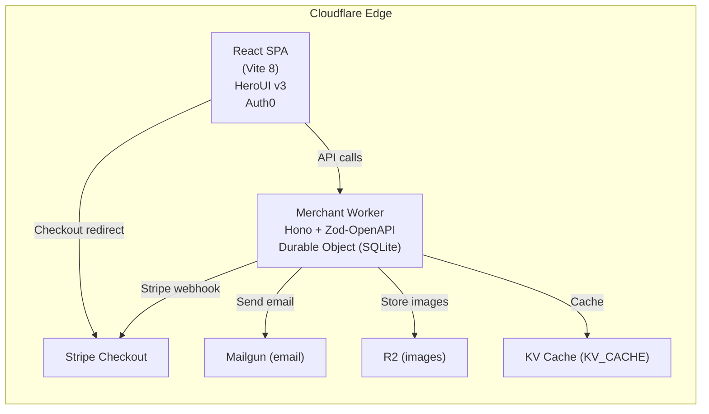

<div align="center">
  <h1>🛍️ Fufuni</h1>
  <p><strong>The 100% free-tier, AI-native e-commerce framework.</strong><br/>
  Built on Cloudflare Workers · Auth0 · Stripe · Mailgun · GitHub Pages</p>

  <a href="https://sctg-development.github.io/fufuni/">
    
  </a>
  <a href="https://github.com/sctg-development/fufuni/stargazers">
    
  </a>
  <a href="https://github.com/sctg-development/fufuni/blob/main/LICENSE">
    
  </a>
  <a href="https://github.com/sctg-development/fufuni/actions/workflows/pages.yaml">
    
  </a>
  <br/>
  
  
  <br/>
  <a href="https://www.typescriptlang.org/"></a>
  <a href="https://react.dev/"></a>
  <a href="https://www.heroui.com/"></a>
  <a href="https://auth0.com/"></a>
  <a href="https://modelcontextprotocol.io/"></a>
</div>

## 🚀 Deploy in 10 minutes, $0/month forever

| Service | Free Tier | Usage in Fufuni |
|---|---|---|
| **Cloudflare Workers** | 100k req/day | Backend API + Durable Objects SQLite |
| **Cloudflare R2** | 10 GB storage | Product images & assets |
| **Auth0** | 7,500 active users | Auth passwordless + social |
| **Mailgun** | 1,000 emails/month | Order notifications |
| **Stripe** | Pay-as-you-go | Payments (no monthly fee) |
| **GitHub Pages** | Unlimited | SPA frontend hosting |

The entire stack can be self-hosted for **€0 / month** within these generous free tiers. GitHub Actions automates deployment — push to `main` and everything deploys automatically.

## 🤖 AI-Native: Universal Commerce Protocol (UCP)

Fufuni is one of the **first open-source frameworks** to implement [UCP](https://ucp.dev),
allowing AI shopping agents (Claude, Gemini, ChatGPT) to interact with your store natively.

```bash
# Discover capabilities
curl https://your-worker.workers.dev/.well-known/ucp

# Browse catalog as an AI agent
curl "https://your-worker.workers.dev/ucp/v1/products?limit=5&q=golf"

# Create a checkout session (no UI needed)
curl -X POST https://your-worker.workers.dev/ucp/v1/checkout-sessions \
  -H "Content-Type: application/json" \
  -d '{"currency":"EUR","line_items":[{"item":{"id":"SKU-001"},"quantity":1}]}'
```

---

## Star the project

**If you appreciate my work, please consider giving it a star! 🤩**

---

## Live Demo

Click the screenshot below to try the public deployment. You can checkout with [any Stripe test card](https://docs.stripe.com/testing#cards) for example `4242 4242 4242 4242` (any future expiry, CVC, and ZIP) — no real charges will be made.

Theme switcher in the top-right corner lets you toggle between `classic` and `luxury` themes, showcasing the dynamic theming capabilities of the platform.
- Base Layout
[](https://sctg-development.github.io/fufuni)

--- 

- Luxury Layout
[](https://sctg-development.github.io/fufuni/index-luxury)

--- 

Visitors see an attractive landing page with a Log in button and direct links to a sample API and autogenerated OpenAPI/Swagger docs — no auth required to view the interface.

---

## Table of Contents

- [Features](#features)
- [Architecture](#architecture)
- [KV Cache \& CDN](#kv-cache--cdn)
- [Quick Start](#quick-start)
- [Configuration Reference](#configuration-reference)
  - [wrangler.jsonc — Variables](#wranglerjsonc--variables)
  - [Frontend `.env`](#frontend-env)
- [API Reference](#api-reference)
  - [Authentication](#authentication)
  - [Products & Variants](#products--variants)
  - [Categories](#categories)
  - [Inventory](#inventory)
  - [Cart & Checkout](#cart--checkout)
  - [Shipping](#shipping)
  - [Orders](#orders)
  - [Customers & Addresses](#customers--addresses)
  - [Discounts](#discounts)
  - [Regions, Currencies & Countries](#regions-currencies--countries)
  - [Warehouses](#warehouses)
  - [Shipping Classes & Rates](#shipping-classes--rates)
  - [Webhooks](#webhooks)
  - [Images](#images)
  - [Mail (test)](#mail-test)
  - [Auth0 helpers](#auth0-helpers)
  - [AI parameters](#ai-parameters)
  - [Setup & config](#setup--config)
- [Database Schema](#database-schema)
  - [Migrations](#migrations)
- [Shipping System](#shipping-system)
  - [Shipping Classes](#shipping-classes)
  - [Cart Weight Calculation](#cart-weight-calculation)
  - [Rate Filtering Logic](#rate-filtering-logic)
- [Multi-Region & Multi-Currency](#multi-region--multi-currency)
- [Authentication & Security](#authentication--security)
- [AI Features](#ai-features)
- [Internationalisation](#internationalisation)
- [Admin Panel](#admin-panel)
- [Deployment](#deployment)
- [GitHub Actions Workflows](#github-actions-workflows)
- [Contributing](#contributing)
- [License](#license)

---

## Features

### 🛍 Products & Catalog
- Product catalogue with variants, SKUs and **per-variant multi-currency pricing**
- **Multilingual product titles** — plain text or JSON per locale, with AI translation
- **Multilingual product descriptions** — rich HTML (Tiptap editor) or JSON per locale, with AI translation
- RTL language support (Arabic, Hebrew)
- Product image management via **Cloudflare R2**
- Inventory management across **multiple warehouses**
- Product **shipping class** assignment (per product or per variant override)
- Per-variant weight (`weightg`) used for automatic cart weight calculation

### 📂 Categories
- **Hierarchical product categories** with optional parent-child relationships
- **Multilingual category names** — JSON per locale with fallback resolution
- **Multilingual descriptions** — rich HTML or JSON per locale
- **One-click AI translation** for names and descriptions across all locales
- Category image URLs for storefront display
- Position-based sorting for custom category ordering
- Public read-only catalog endpoints, admin CRUD operations
- Real-time permission checking for AI translation features

### 💳 Payments & Orders
- **Stripe Checkout** integration with full webhook reconciliation
- Multi-currency, multi-region pricing — explicit per-variant prices in `variantprices`
- **Dynamic shipping options in Stripe** — rates come from your DB, not hardcoded values
- Order lifecycle: `pending → paid → processing → shipped → delivered → refunded → canceled`
- Tracking number and URL per order
- **Discount codes** — fixed amount or percentage, with Stripe coupon sync
- **Order confirmation emails** via Mailgun with signed 30-day view-token links
- Secure order status page accessible via JWT token (no login required)
- Public order lookup by Stripe session ID

### 🚚 Shipping
- **Shipping rates** with weight limits and delivery day estimates
- **Shipping classes** for product-specific transport constraints (`exclusive` or `additive`)
- **Cart weight calculation** from variant weights — automatic, computed server-side
- **Multi-class cart filtering** — exclusive classes hide incompatible rates; additive classes add theirs
- **Region-bound rates** — rates are linked to regions, not shown globally
- **Address collection** before checkout with automatic revalidation of the selected rate
- Per-rate multi-currency pricing via `shippingrateprices`

### 👤 Customers & Auth
- **Auth0-based authentication** for admin (JWT, RBAC, configurable permissions)
- **Customer accounts** with address book
- **OAuth 2.0 / UCP** (Universal Commerce Protocol) for customer-facing flows
- **Wishlist** (favorites) — products stored in Auth0 user_metadata
- **Saved carts** — full cart snapshots stored in Auth0 user_metadata for quick retrieval
- Magic-link checkout

### � Store Themes
- **Multi-theme architecture** — built-in `classic` (light/dark) and `luxury` themes
- Themes stored in `store_themes` table and served via `GET /v1/theme/active`
- `StoreThemeProvider` applies `data-theme` on `<html>` at boot, preventing FOUC
- Persistent user preference via `localStorage` (`ui-theme` key)
- Floating `ThemeSwitcher` dropdown for instant preview/switch
- Theme config overrides CSS variables (`--accent`, `--radius`, font stacks) without a redeploy

### 🛒 Storefront UX
- **CartDrawer** — slide-in right panel for cart items with quantity controls, no separate cart page needed
- **WishlistButton** — heart toggle on product cards; LoginModal shown to unauthenticated users with pending action preserved across Auth0 redirect via `sessionStorage`
- **HeroBanner** — full-width hero section with configurable image, overlay, title and CTA
- **ProductCarousel** — horizontal snap-scroll carousel of product cards
- **CategoryBentoGrid** — asymmetric editorial grid (up to 5 categories, first spanning 2 columns)

### �🌍 Internationalisation
- **6 built-in locales**: English (US), French, Spanish, Chinese (Simplified), Arabic, Hebrew
- `availableLanguages` registry with `nativeName`, `isRTL`, `isDefault` flags
- Locale-aware price display (`Intl.NumberFormat`, ISO 4217)

### 🤖 AI Features
- **One-click translation** for product titles and descriptions directly in the admin panel
- **AI-assisted review moderation** — admins can analyze pending reviews individually or in batch; the AI returns an `approve`/`reject` recommendation with a one-sentence reason displayed inline
- Batch workflow: select reviews → Analyze with AI → one-click "Approve all AI-recommended" or "Reject all AI-flagged"
- Provider auto-detection: Groq, OpenAI, Anthropic
- Permission-gated — only admins holding the `AI_PERMISSION` claim can trigger AI features
- The backend exposes `GET /v1/ai/parameters` (key, model, URL) — **all AI calls are made client-side** so the LLM API key never leaves the browser via a server-side proxy
- HTML-aware translation preserves Tiptap markup; plain-text mode for titles

### � Analytics Dashboard
- **Admin-only analytics** endpoint — all metrics computed server-side from existing tables, no external service needed
- Period selector: **last 7 days**, **30 days**, **90 days**, or **all time**
- KPIs: total revenue, order count, average order value, customer count (new vs returning), low-stock SKU count
- **Top 10 products** by revenue with unit sales and revenue per product
- **Orders by status** breakdown (paid, processing, shipped, delivered, …)
- Multilingual product title decoding via `resolveTitle()` — JSON-localized titles render in the admin's active locale

### � Configurable Order Email Templates
- **Per-event transactional emails** — independent template for each lifecycle event: `pending`, `paid`, `payment_failed`, `processing`, `shipped`, `delivered`, `refunded`, `canceled`, plus a `global` fallback
- **TipTap WYSIWYG editor** for the HTML body with full rich-text controls
- **Plain-text body** — editable textarea; one-click **Generate from HTML** button strips tags from the current HTML body (does not translate)
- **Multilingual templates** — locale selector (6 built-in locales); each field (subject, HTML body, plain-text body) stores a JSON locale map (`{"en-US":"...", "fr-FR":"..."}`)
- **One-click AI translation** — Sparkles button on both the subject and HTML body fields; tokenises `{{variables}}` before sending to the LLM so placeholders survive translation; uses formal register and `vous`/`usted`/`Sie`/`Lei` address forms
- **Default templates** — per-event polished HTML with status badge, heading, dynamic order details and CTA button; inserted with a single click
- **Default subjects** — per-event pre-written English subject line (e.g. *Your order has shipped! — {{storeName}}*), insertable with one click
- **Test send** — send a live email to any address from within the admin UI
- **Enable/disable per event** — each event-specific template can be toggled on/off independently; the `global` row acts as the catch-all fallback
- **Template variables** available in all fields: `{{storeName}}`, `{{orderNumber}}`, `{{orderUrl}}`, `{{status}}`, `{{total}}`, `{{customerName}}`, `{{trackingNumber}}`, `{{trackingUrl}}`

### 🖥 Admin Panel
Full-featured back-office covering:
- Products, Variants, Inventory, Orders, Customers
- Regions, Currencies, Countries, Warehouses
- **Shipping Rates** + **Shipping Classes**
- Webhooks, Discounts, Users & Permissions
- **Analytics Dashboard** — store KPIs and top products
- **Order Email Templates** — per-event configurable HTML/plain-text emails with AI translation
- OpenAPI / Swagger UI integrated

### ⚙️ Infrastructure
- **Cloudflare Workers** — zero-cold-start edge API (Hono + Zod-OpenAPI)
- **Durable Objects** (SQLite) — 100 % of store state, no D1 required
- **Cloudflare R2** — product image storage
- **Cloudflare KV** — caching layer (`KV_CACHE`) with variable TTL, bypass rules for admin tokens, and prefix-based invalidation on mutations
- Rate limiting middleware (per endpoint, per role)
- Outbound webhooks with HMAC signing and delivery log
- Scheduled cron every hour at :15 for cart expiry cleanup

---

## Architecture



### Project Structure

```
.
├── apps/
│   ├── client/                           # React frontend (storefront + admin)
│   │   └── src/
│   │       ├── pages/admin/
│   │       │   ├── products.tsx
│   │       │   ├── shipping-classes.tsx
│   │       │   ├── shipping-rates.tsx
│   │       │   └── ...
│   │       ├── lib/store-api.ts          # Typed API client
│   │       └── utils/ai-client.ts        # AI translation (runs entirely client-side)
│   └── merchant/                         # Cloudflare Worker
│       ├── migrations/                   # 001 → 018 SQL files
│       └── src/
│           ├── do.ts                     # Durable Object (SCHEMA + ensureInitialized)
│           ├── lib/
│           │   ├── shipping.ts           # getCompatibleShippingRates, computeCartWeightG
│           │   ├── pricing.ts
│           │   ├── order-email.ts
│           │   └── order-token.ts
│           └── routes/
│               ├── checkout.ts
│               ├── regions.ts            # Regions + Shipping Classes CRUD
│               ├── catalog.ts
│               └── ...
```

---

## KV Cache & CDN

Fufuni caches public read endpoints in **Cloudflare KV** to slash Durable Object invocations, and uses the **Cloudflare Cache API** to serve product images from edge PoPs.

### KV Cache (catalog & categories)

The `kvCacheMiddleware` in `apps/merchant/src/middleware/kv-cache.ts` intercepts GET requests on `/v1/products/*` and `/v1/categories/*` **before** they reach the Durable Object.

**Cache key:** `cache:<full-url>` — query params are included, so paginated and filtered responses are cached independently.

**TTL policy:**

| Endpoint pattern | TTL |
|---|---|
| `/v1/products/search` | 5 minutes |
| `/v1/products/:id/reviews` | 10 minutes |
| All other catalog & category routes | 1 hour |

**Bypass rules:**

| Request type | Cached? | Reason |
|---|---|---|
| Non-GET methods | ❌ | Mutations must always reach the DO |
| `Authorization: Bearer sk_...` | ❌ | Admin key — may return unpublished data |
| Auth0 JWT | ❌ | Permission-scoped response |
| `Authorization: Bearer pk_...` | ✅ | Public store key — identical response for every visitor |
| No Authorization header | ✅ | Truly public endpoints |

**Invalidation:** on any successful `POST`, `PATCH`, or `DELETE` to products or categories, `kvInvalidateMiddleware` purges **all** `cache:*/v1/products` and `cache:*/v1/categories` entries by iterating `kv.list()` pages — covers paginated/filtered keys automatically.

**Response header:** `X-KV-Cache: HIT | MISS` set on every cached route.

> `KV_CACHE` must be declared in `wrangler.jsonc` (see [Cloudflare Bindings](#cloudflare-bindings-wranglerjsonc)).

Environment variables (and GitHub Secrets) `KV_CACHE_SEARCH_TTL_SECONDS`, `KV_CACHE_REVIEWS_TTL_SECONDS`, and `KV_CACHE_DEFAULT_TTL_SECONDS` allow TTL customization without code changes (defaults: 300, 600, and 3600 seconds respectively).

### CDN Cache (images)

Product images served from R2 are additionally cached at the Cloudflare edge via the [Cache API](https://developers.cloudflare.com/workers/runtime-apis/cache/) (`caches.default`):

1. On `GET /v1/images/:key`, the Worker checks `caches.default.match(request)` first.
2. On a miss, the image is pulled from R2 and stored via `cache.put()` (inside `waitUntil`).
3. On `DELETE /v1/images/:key`, the CDN entry is purged alongside the R2 object.
4. Admins can force-purge all or individual CDN entries at any time via dedicated endpoints.

> ⚠️ **wrangler dev note:** `caches.default` is **not available** in `wrangler dev`. CDN hit/miss counters will stay at 0 during local development — deploy to Cloudflare to see live CDN metrics.

### Cache Analytics

The `GET /v1/analytics/cache-stats` endpoint (admin-only) returns cumulative counters stored in KV:

```json
{
  "kv":  { "hits": 1234, "misses": 89,  "hit_rate": 0.93, "entries": 47 },
  "cdn": { "hits": 5012, "misses": 203, "hit_rate": 0.96 }
}
```

These are surfaced as progress bars on the `/admin/analytics` dashboard. Counters are cumulative and never reset; accuracy is approximate under concurrent load (non-atomic KV read-modify-write).

---

## Quick Start

### Backend (Merchant Worker)

```bash
# 1. Install from monorepo root
npm install

# 2. Create initial API keys + schema
npx tsx apps/merchant/scripts/init.ts

# 3. Run locally
cd apps/merchant && npm run dev

# 4. Seed demo data (optional)
npx tsx apps/merchant/scripts/seed.ts

# 5. Connect Stripe
curl -X POST http://localhost:8787/v1/setup/stripe \
  -H "Authorization: Bearer sk-your-admin-key" \
  -H "Content-Type: application/json" \
  -d '{"stripesecretkey":"sk_test_..."}'
```

### Auth0 setup (minimal, automated)
The project includes scripts that automate Auth0 tenant setup and post-login action configuration.

1. Create Auth0 tenant (e.g. `mystore.us.auth0.com`).
2. In Auth0 dashboard:
   - Go to **APIs** > **Auth0 Management API** > **Test**.
   - Click **Create and Authorize Test Application**.
   - In **Application Access**, choose the test app and select **All** permissions.
3. Copy values into your env file:
   - `AUTH0_DOMAIN=<tenant>.us.auth0.com`
   - `AUTH0_TENANT=<tenant>`
   - `AUTH0_MANAGEMENT_API_CLIENT_ID=<client_id>`
   - `AUTH0_MANAGEMENT_API_CLIENT_SECRET=<client_secret>`
   - `AUTH0_AUDIENCE=https://api.<your-domain>/`
   - `STORE_URL=http://localhost:5173`
4. Run the script:
   `npx tsx scripts/auth0/deploy-tenant-resources.ts -- --env-file=.env`

### Frontend (Admin + Storefront)

```bash
cp apps/client/.env.example apps/client/.env
# → Fill in AUTH0_*, API_BASE_URL, MERCHANT_PK, STRIPE_PUBLISHABLE_KEY
#    (don’t forget AUTH0_SCOPE and AUTH0_AUTOMATIC_PERMISSIONS for Auth0 auth)

npm run dev:env   # from monorepo root
# Starts both workspaces in parallel with .env variables loaded:
# → Merchant Worker : http://localhost:8787  (.env is copied to apps/merchant/.dev.vars)
# → Client Vite SPA : http://localhost:5173  (.env sourced for vite.config.ts define block)

# Optional: Stripe webhook forwarder (requires Stripe CLI installed)
npm run stripe:listen
# Reads STRIPE_SECRET_KEY from .env and forwards Stripe events to localhost:8787

# Optional: mount the store at a subpath (e.g. for testing CORS_ORIGIN adjustments)
npm run dev:env -- --base=/fufuni
# → client Vite: http://localhost:5173/fufuni
# → merchant .dev.vars: STORE_URL/CORS_ORIGIN adjusted automatically
```

### NPM scripts reference

Run all scripts from the **monorepo root** unless noted otherwise.

| Command | Description |
|---------|-------------|
| `npm run dev:env` | Start full dev environment (Worker + Vite) with `.env` variables loaded. Worker: `localhost:8787`. Frontend: `localhost:5173`. |
| `npm run dev:env -- --base=/fufuni` | Same, but mounts the SPA at `/fufuni` and adjusts `STORE_URL`/`CORS_ORIGIN` in the Worker `.dev.vars`. |
| `npm run stripe:listen` | Forward Stripe webhook events to `localhost:8787` (requires Stripe CLI; reads `STRIPE_SECRET_KEY` from `.env`). |
| `npm run build:env` | Build all workspaces (Worker + client SPA) sourcing `.env`. Used by CI. |
| `npm run build:client:env` | Build only the client SPA sourcing `.env`. |
| `npm run preview:env` | Preview the built SPA (and merchant) with `.env` loaded. |
| `npm run dev` | Start both workspaces without loading `.env` (no Auth0/API keys — limited functionality). |
| `npm run clean:seed:start` | Reset local DB, seed demo data, and start dev environment. |
| `npm run mcp:generate` | Generate MCP knowledge-base files in `mcp/` (AI-assisted). |
| `npm run mcp:generate:force` | Regenerate all MCP files (overwrites existing). |

> **`dev:env` vs `dev`:** Always use `dev:env` for real development — it loads `.env` so Auth0, Stripe, Mailgun, and API keys are available. `dev` is only useful for quick smoke-tests with no external services.

---

## MCP Knowledge Base

`apps/mcp` is a **Cloudflare Worker** that exposes the Fufuni codebase knowledge as a remote [Model Context Protocol (MCP)](https://modelcontextprotocol.io/) server. AI assistants (Claude, VS Code Copilot, Cursor…) can connect to it and query structured documentation about the project without needing access to the source files.

### Architecture

```
mcp/*.md          ← static knowledge files (one per topic, generated by a script)
       ↓
apps/mcp/scripts/gen-knowledge.ts   ← bundles all .md into src/knowledge.ts
       ↓
apps/mcp/src/index.ts               ← MCP Worker (FufuniMCP extends McpAgent)
       ↓
/mcp  (Streamable HTTP)             ← endpoint for MCP clients
/sse  (SSE, legacy)                 ← fallback for older clients
```

Each `mcp/*.md` file becomes:
- a **dedicated tool** named after the slug (e.g. `cloudflare_worker_patterns`)
- accessible via the generic `get_topic(slug)` tool
- listed by `list_topics`

### Local Development

```bash
# From apps/mcp/ — generates knowledge bundle, starts wrangler dev + MCP inspector
npm run dev
# → MCP Worker:   http://localhost:8788/mcp
# → MCP Inspector opens automatically in your browser
```

To connect VS Code Copilot or Claude Desktop to the **local** server:

```json
{
  "mcpServers": {
    "fufuni": {
      "command": "npx",
      "args": ["mcp-remote", "http://localhost:8788/mcp"]
    }
  }
}
```

### Update the Knowledge Base

The knowledge files (`mcp/*.md`) are generated by an AI-assisted script that reads the source code and writes structured Markdown.

```bash
# Generate only missing topics (safe, won't overwrite)
npm run mcp:generate

# Force-regenerate all 17 topics (overwrites existing files)
npm run mcp:generate:force

# Regenerate a single topic
npx tsx scripts/generate-static-mcp-response.ts --topic=cloudflare-worker-patterns --force
```

**When to regenerate:**
- After adding a new route, migration, or feature — regenerate the relevant topic
- After adding a new topic definition to `scripts/generate-static-mcp-response.ts`
- Before deploying the MCP Worker (`deploy-mcp.yaml` runs `gen-knowledge` automatically)

**Adding a new topic:** edit `scripts/generate-static-mcp-response.ts`, add a new entry to the `TOPICS` array with `name`, `description`, `sources[]`, and `buildPrompt`. Then run `npm run mcp:generate`.

### Deploy to Production

CI deploys the MCP Worker automatically on every push to `main` that changes `apps/mcp/**` or `mcp/**` (via `.github/workflows/deploy-mcp.yaml`).

```bash
# Manual deploy from apps/mcp/
npm run deploy
# Worker live at: https://fufuni-mcp.<your-account>.workers.dev/mcp
```

The MCP Worker is publicly deployed at **`https://fufuni-mcp.fufuni.workers.dev/mcp`**.

To connect a remote MCP client (Claude Desktop, Cursor, generic `mcpServers` config):

```json
{
  "mcpServers": {
    "fufuni": {
      "command": "npx",
      "args": ["mcp-remote", "https://fufuni-mcp.fufuni.workers.dev/mcp"]
    }
  }
}
```

**VS Code Copilot** — add to `.vscode/mcp.json` (already included in this repository):

```json
{
  "servers": {
    "fufuni": {
      "type": "http",
      "url": "https://fufuni-mcp.fufuni.workers.dev/mcp"
    }
  }
}
```

Once configured, VS Code Copilot Agent will automatically discover and use the Fufuni knowledge tools (`list_topics`, `get_topic`, per-topic tools) when working in this repository.

---

### Deploy to Production

```bash
cd apps/merchant
wrangler deploy          # DO, R2 and KV auto-provisioned

# Set secrets
wrangler secret put STRIPE_SECRET_KEY
wrangler secret put STRIPE_WEBHOOK_SECRET
wrangler secret put ORDER_TOKEN_SECRET
wrangler secret put MAILGUN_API_KEY
wrangler secret put AUTH0_CLIENT_SECRET
wrangler secret put AUTH0_MANAGEMENT_API_CLIENT_SECRET

# Initialise remote store
npx tsx scripts/init.ts --remote
```

---

## Configuration Reference

### wrangler.jsonc — Variables

All variables are set under `vars` in `wrangler.jsonc`.
Sensitive values (secrets) should be set with `wrangler secret put`.

| Variable | Required | Description |
|---|---|---|
| `MERCHANT_SK` | ✅ secret | Admin API key (`sk...`) |
| `MERCHANT_PK` | ✅ | Public API key (`pk...`) |
| `STRIPE_SECRET_KEY` | ✅ secret | Stripe secret key |
| `STRIPE_WEBHOOK_SECRET` | ✅ secret | Stripe webhook signing secret |
| `ORDER_TOKEN_SECRET` | ✅ secret | HMAC secret for order view tokens |
| `AUTH0_DOMAIN` | ✅ | Auth0 tenant domain (e.g. `fufuni.eu.auth0.com`) |
| `AUTH0_AUDIENCE` | ✅ | Auth0 API audience (e.g. `https://api.fufuni.pp.ua`) |
| `AUTH0_CLIENT_ID` | ✅ | Auth0 M2M or SPA client ID |
| `AUTH0_CLIENT_SECRET` | ✅ secret | Auth0 client secret |
| `AUTH0_MANAGEMENT_API_CLIENT_ID` | ✅ | Auth0 Management API client ID |
| `AUTH0_MANAGEMENT_API_CLIENT_SECRET` | ✅ secret | Auth0 Management API client secret |
| `AUTH0_SCOPE` | ⚙️ | OAuth scopes (default: `openid profile email`) |
| `AUTH0_AUTOMATIC_PERMISSIONS` | ⚙️ | Comma-separated permissions to auto-provision |
| `ADMIN_STORE_PERMISSION` | ⚙️ | JWT permission for store admin routes (default: `admin:store`) |
| `ADMIN_AUTH0_PERMISSION` | ⚙️ | JWT permission for Auth0 management routes (default: `auth0:admin:api`) |
| `DATABASE_PERMISSION` | ⚙️ | JWT permission for database admin routes (default: `admin:database`) |
| `AI_PERMISSION` | ⚙️ | JWT permission for AI parameter endpoint (default: `ai:api`) |
| `MAIL_PERMISSION` | ⚙️ | JWT permission for test mail endpoint (default: `mail:api`) |
| `WANT_PERMISSION` | ⚙️ | JWT permission for UCP/want routes (default: `wantapi`) |
| `AI_API_KEY` | ⚙️ | AI provider API key (returned to authorised clients) |
| `AI_MODEL` | ⚙️ | AI model name (e.g. `openai/gpt-oss-20b`) |
| `AI_API_URL` | ⚙️ | AI provider base URL (e.g. `https://api.groq.com/openai/v1`) |
| `MAILGUN_API_KEY` | ⚙️ secret | Mailgun API key |
| `MAILGUN_DOMAIN` | ⚙️ | Mailgun sending domain |
| `MAILGUN_BASE_URL` | ⚙️ | Mailgun API base URL (default: `https://api.mailgun.net`) |
| `MAILGUN_USER` | ⚙️ | Mailgun sender address |
| `STORE_URL` | ⚙️ | Public storefront URL (used in email links) |
| `STORE_NAME` | ⚙️ | Store display name (used in emails) |
| `IMAGES_URL` | ⚙️ | Public URL of the R2 bucket |
| `CORS_ORIGIN` | ⚙️ | Allowed CORS origin (e.g. `http://localhost:5173`) |
| `API_BASE_URL` | ⚙️ | Worker URL (used internally) |
| `CRYPTOKEN` | ⚙️ | Hex token for crypto operations |
| `KV_CACHE_ID` | ⚙️ | KV namespace ID (mirrors the `KV_CACHE` binding) |
| `KV_CACHE_SEARCH_TTL_SECONDS` | ⚙️ | Custom TTL for product search cache (default: 300) |
| `KV_CACHE_REVIEWS_TTL_SECONDS` | ⚙️ | Custom TTL for product reviews cache (default: 600) |
| `KV_CACHE_DEFAULT_TTL_SECONDS` | ⚙️ | Custom TTL for all other cache entries (default: 3600) |

#### Cloudflare Bindings (wrangler.jsonc)

```jsonc
{
  "durable_objects": {
    "bindings": [{ "name": "MERCHANT", "class_name": "MerchantDO" }]
  },
  "r2_buckets": [{ "binding": "IMAGES" }],
  "kv_namespaces": [{ "binding": "KV_CACHE", "id": "<your-kv-id>" }],
  "triggers": { "crons": ["15 * * * *"] }
}
```

> ⚠️ **No D1 binding** — all store data lives in the Durable Object's built-in SQLite. Migrations are applied automatically via `ensureInitialized()` in `do.ts`.

### Frontend `.env`

| Variable | Required | Description |
|---|---|---|
| `AUTHENTICATION_PROVIDER_TYPE` | ✅ | `auth0` or `dex` |
| `AUTH0_CLIENT_ID` | ✅ | Auth0 SPA Client ID |
| `AUTH0_DOMAIN` | ✅ | Auth0 tenant domain |
| `AUTH0_AUDIENCE` | ✅ | Auth0 API identifier |
| `AUTH0_SCOPE` | ✅ | Auth0 OAuth scopes (e.g. `openid profile email`) |
| `AUTH0_CACHE_DURATION_S` | ⚙️ | Cache duration (seconds) for Auth0 Management API tokens (default: 300) |
| `AUTH0_AUTOMATIC_PERMISSIONS` | ⚙️ | Comma-separated permissions to auto-assign to the signed-in user |
| `API_BASE_URL` | ✅ | Worker base URL |
| `MERCHANT_PK` | ✅ | Public API key for storefront calls |
| `ADMIN_AUTH0_PERMISSION` | ✅ | Auth0 permission granting admin panel access |
| `ADMIN_STORE_PERMISSION` | ✅ | Auth0 permission granting store management |
| `DATABASE_PERMISSION` | ⚙️ | Auth0 permission for database admin routes (used by backend) |
| `AI_PERMISSION` | ⚙️ | Auth0 permission for AI credentials endpoint |
| `MAIL_PERMISSION` | ⚙️ | Auth0 permission for test mail endpoint |
| `STORE_URL` | ⚙️ | Public storefront URL (used in emails) |
| `STORE_NAME` | ⚙️ | Store name (used in emails) |
| `STRIPE_PUBLISHABLE_KEY` | ⚙️ | Stripe publishable key |

> 💡 **Vite access pattern**: in the frontend source code, all variables above are accessed as `import.meta.env.VARIABLE_NAME` (defined by `vite.config.ts`'s `define` block — not the native `VITE_` prefix mechanism). `import.meta.env.PERMISSIONS` is a string array derived from all `*_PERMISSION` values in `.env`. To expose a new variable to the frontend, add it to the `define` block in `apps/client/vite.config.ts` AND to `create-env-artifact.yaml` (GitHub CI encrypted artifact).

---

## API Reference

### Authentication

All routes (unless marked **public**) require:
```
Authorization: Bearer <key_or_jwt>
```

**Accepted credentials:**

| Credential | Format | Access level |
|---|---|---|
| Admin API key | `sk...` (64+ chars) | Full admin access  to legacy endpoints |
| Public API key | `pk...` | Cart, checkout, read-only catalog |
| Auth0 JWT | RS256 signed by your tenant | Role determined by JWT permissions |
| 64-char hex token | customer OAuth token | Customer-scoped routes |

**JWT permission claims** (values configurable via env vars):

| Permission | Routes | Env var |
|---|---|---|
| `admin:store` | All store management routes | `ADMIN_STORE_PERMISSION` |
| `auth0:admin:api` | Auth0 Management API proxy | `ADMIN_AUTH0_PERMISSION` |
| `admin:database` | Database reset, config read | `DATABASE_PERMISSION` |
| `ai:api` | `GET /v1/ai/parameters` | `AI_PERMISSION` |
| `mail:api` | `POST /v1/mails/send` | `MAIL_PERMISSION` |
| `want:sapi` | UCP / want routes | `WANT_PERMISSION` |

---

### Products & Variants

| Method | Path | Auth | Description |
|---|---|---|---|
| `GET` | `/v1/products` | bearer | List products (`?limit`, `?cursor`, `?status`) |
| `POST` | `/v1/products` | `admin:store` | Create product |
| `GET` | `/v1/products/search?q=` | bearer | Full-text search |
| `GET` | `/v1/products/pricing-audit?currencyId=` | `admin:store` | List active variants missing a price for a currency |
| `GET` | `/v1/products/:id` | bearer | Get product |
| `PATCH` | `/v1/products/:id` | `admin:store` | Update product (`title`, `description`, `shippingclassid`, `status`) |
| `DELETE` | `/v1/products/:id` | `admin:store` | Delete product |
| `POST` | `/v1/products/:id/variants` | `admin:store` | Add variant (`sku`, `title`, `pricecents`, `currency`, `weightg`, `shippingclassid`) |
| `PATCH` | `/v1/products/:id/variants/:variantId` | `admin:store` | Update variant |
| `DELETE` | `/v1/products/:id/variants/:variantId` | `admin:store` | Delete variant |
| `GET` | `/v1/products/:id/variants/:variantId/prices` | `admin:store` | List per-currency prices |
| `POST` | `/v1/products/:id/variants/:variantId/prices` | `admin:store` | Set price for a currency (`currencyid`, `pricecents`) |
| `DELETE` | `/v1/products/:id/variants/:variantId/prices/:currencyId` | `admin:store` | Remove a currency price |

> `shippingclassid` can be set on **both** the product (default for all variants) and per-variant (overrides product).

---

### Categories

| Method | Path | Auth | Description |
|---|---|---|---|
| `GET` | `/v1/categories` | **public** | List all active categories (flat list ready for tree building) |
| `POST` | `/v1/categories` | `admin:store` | Create category |
| `GET` | `/v1/categories/:handle` | **public** | Get a category by handle with full details |
| `GET` | `/v1/categories/:handle/products` | **public** | List products in a category (`?limit`, `?cursor`) |
| `PATCH` | `/v1/categories/:id` | `admin:store` | Update category (`handle`, `name`, `description`, `parent_id`, `image_url`, `position`, `status`) |
| `DELETE` | `/v1/categories/:id` | `admin:store` | Delete category |
| `POST` | `/v1/categories/:id/products` | `admin:store` | Assign products to category (`product_ids: [...]`) |
| `DELETE` | `/v1/categories/:id/products/:productId` | `admin:store` | Remove product from category |

**Category data structure:**

```json
{
  "id": "uuid",
  "handle": "t-shirts",
  "name": "{\"en-US\":\"T-Shirts\",\"fr-FR\":\"T-Shirts\"}",
  "description": "{\"en-US\":\"Collection of classic tees\"}",
  "parent_id": null,
  "position": 0,
  "image_url": "https://r2.example.com/category-tees.jpg",
  "status": "active",
  "created_at": "2026-03-28T08:01:31.772Z",
  "updated_at": "2026-03-28T08:01:31.778Z"
}
```

**Multilingual storage:**

Category `name` and `description` fields support two formats:

1. **Plain text** (for single-locale categories):
   ```json
   { "name": "T-Shirts" }
   ```

2. **JSON per-locale** (for multilingual catalogs):
   ```json
   {
     "name": "{\"en-US\":\"T-Shirts\",\"fr-FR\":\"T-Shirts\",\"es-ES\":\"Camisetas\"}",
     "description": "{\"en-US\":\"Classic tee collection by season\",\"fr-FR\":\"...\"}"
   }
   ```

The admin UI automatically **migrates** from plain text to JSON when switching locales, preserving all existing translations and allowing per-locale AI translation.

**AI Translation:**

The CategoryAdmin component includes one-click AI translation buttons for category names and descriptions. This feature:
- Requires the `AI_PERMISSION` claim (`ai:api` by default)
- Uses the same AI provider configured for product translations
- Automatically detects the source language from fallback locales
- Preserves HTML markup in descriptions via `isHtml` mode
- Updates form state atomically (both display value and JSON structure)

**Admin panel:**

Access category management at `/admin/categories` (requires `admin:store` permission).
Features include:
- Full CRUD with parent category support for hierarchies
- Multilingual name and description editor
- Locale switcher with auto-migration
- One-click AI translation (when user has `ai:api` permission)
- Image URL assignment
- Position-based ordering
- Status (active/inactive) toggle
- Delete confirmation dialog

---

### Inventory

| Method | Path | Auth | Description |
|---|---|---|---|
| `GET` | `/v1/inventory` | `admin:store` | List inventory (`?lowstock=true`, `?limit`, `?cursor`) |
| `POST` | `/v1/inventory/:sku/adjust` | `admin:store` | Adjust stock (`delta`, `reason`) |
| `GET` | `/v1/inventory/warehouse` | `admin:store` | Per-warehouse inventory |
| `POST` | `/v1/inventory/{sku}/warehouse-adjust` | `admin:store` | Adjust warehouse stock (`warehouse_id`, `delta`, `reason`) |
| `POST` | `/v1/inventory/{sku}/warehouse-delete` | `admin:store` | Remove warehouse inventory entry |

`reason` values: `restock`, `correction`, `damaged`, `return`, `sale`, `release`

---

### Cart & Checkout

| Method | Path | Auth | Description |
|---|---|---|---|
| `POST` | `/v1/carts` | public | Create cart (`customeremail`, optional `regionid`) |
| `GET` | `/v1/carts/:cartId` | public | Get cart with items, shipping and totals |
| `POST` | `/v1/carts/:cartId/items` | public | Replace cart items (`[{sku, qty}]`) |
| `PUT` | `/v1/carts/:cartId/shipping-address` | public | Set shipping address (required before rate selection) |
| `GET` | `/v1/carts/:cartId/available-shipping-rates` | public | List compatible rates for this cart |
| `PUT` | `/v1/carts/:cartId/shipping-rate` | public | Select a shipping rate (`shippingrateid`) |
| `POST` | `/v1/carts/:cartId/apply-discount` | public | Apply a discount code (`code`) |
| `DELETE` | `/v1/carts/:cartId/discount` | public | Remove discount |
| `POST` | `/v1/carts/:cartId/checkout` | public | Create Stripe Checkout session → `{checkouturl, stripecheckoutsessionid}` |

**Standard checkout flow:**
```
POST /v1/carts                                 → create cart
POST /v1/carts/:id/items                       → add items
PUT  /v1/carts/:id/shipping-address            → set delivery address
GET  /v1/carts/:id/available-shipping-rates    → list rates (weight + class aware)
PUT  /v1/carts/:id/shipping-rate               → select rate
POST /v1/carts/:id/checkout                    → redirect to Stripe
     ↓ customer pays
Stripe webhook → order created, stock committed, confirmation email sent
```

The `POST /v1/carts/:id/checkout` body:

| Field | Type | Description |
|---|---|---|
| `successurl` | string (uri) | Redirect after successful payment |
| `cancelurl` | string (uri) | Redirect on cancel |
| `collectshipping` | boolean | Whether Stripe collects address (default `false`) |
| `shippingcountries` | string[] | Restrict allowed countries in Stripe |
| `shippingoptions` | array\|null | Override shipping options (leave null to use DB rates) |

---

### Shipping

#### Get Available Rates

```
GET /v1/carts/:cartId/available-shipping-rates
```

Response `AvailableShippingRates`:
```json
{
  "items": [
    {
      "id": "uuid",
      "displayname": "Standard Shipping",
      "description": "5-7 business days",
      "amountcents": 499,
      "currency": "EUR",
      "mindeliverydays": 5,
      "maxdeliverydays": 7,
      "maxweightg": 5000
    }
  ],
  "carttotalweightg": 1200
}
```

Rates are filtered by:
1. Region (only rates linked to the cart's region via `regionshippingrates`)
2. Weight (`maxweightg >= carttotalweightg`, or null = no limit)
3. Shipping class (see [Shipping System](#shipping-system))

---

### Orders

| Method | Path | Auth | Description |
|---|---|---|---|
| `GET` | `/v1/orders` | `admin:store` | List orders (`?status`, `?email`, `?limit`, `?cursor`) |
| `POST` | `/v1/orders/test` | `admin:store` | Create test order (bypasses Stripe) |
| `GET` | `/v1/orders/lookup?session_id=` | **public** | Look up order by Stripe checkout session ID |
| `GET` | `/v1/orders/:orderId` | `admin:store` | Get order by ID |
| `PATCH` | `/v1/orders/:orderId` | `admin:store` | Update status / tracking |
| `POST` | `/v1/orders/:orderId/refund` | `admin:store` | Full or partial Stripe refund |
| `POST` | `/v1/orders/:orderId/resend-confirmation` | `admin:store` | Resend confirmation email (regenerates token if missing) |
| `POST` | `/v1/orders/:orderId/regenerate-tracking-link` | `admin:store` | Regenerate view token + resend email |
| `GET` | `/v1/orders/:orderId/status?token=` | **public** | View order status via signed JWT token |

---

### Customers & Addresses

| Method | Path | Auth | Description |
|---|---|---|---|
| `GET` | `/v1/customers` | `admin:store` | List customers |
| `GET` | `/v1/customers/:id` | `admin:store` | Get customer with addresses |
| `PATCH` | `/v1/customers/:id` | `admin:store` | Update customer (`name`, `phone`, `acceptsmarketing`, `metadata`) |
| `DELETE` | `/v1/customers/:id` | `admin:store` | Delete customer |
| `GET` | `/v1/customers/:id/addresses` | `admin:store` | List addresses |
| `POST` | `/v1/customers/:id/addresses` | `admin:store` | Add address |
| `DELETE` | `/v1/customers/:id/addresses/:addressId` | `admin:store` | Delete address |
| `GET` | `/v1/customers/:id/orders` | `admin:store` | List customer orders |

---

### Discounts

| Method | Path | Auth | Description |
|---|---|---|---|
| `GET` | `/v1/discounts` | `admin:store` | List discounts |
| `POST` | `/v1/discounts` | `admin:store` | Create discount (auto-synced to Stripe coupon) |
| `PATCH` | `/v1/discounts/:id` | `admin:store` | Update discount |
| `DELETE` | `/v1/discounts/:id` | `admin:store` | Delete discount |

---

### Regions, Currencies & Countries

| Method | Path | Auth | Description |
|---|---|---|---|
| `GET/POST` | `/v1/regions` | `admin:store` | List / create regions |
| `GET/PATCH/DELETE` | `/v1/regions/:id` | `admin:store` | Get / update / delete region |
| `POST` | `/v1/regions/:id/countries` | `admin:store` | Associate country with region |
| `POST` | `/v1/regions/:id/warehouses` | `admin:store` | Associate warehouse with region |
| `POST` | `/v1/regions/:id/shipping-rates` | `admin:store` | Associate shipping rate with region |
| `GET/POST` | `/v1/regions/currencies` | `admin:store` | List / create currencies |
| `GET/PATCH/DELETE` | `/v1/regions/currencies/:id` | `admin:store` | Manage a currency |
| `GET/POST` | `/v1/regions/countries` | `admin:store` | List / create countries |
| `GET/POST` | `/v1/regions/countries/batch` | `admin:store` | Get all / batch-create countries |
| `GET/PATCH/DELETE` | `/v1/regions/countries/:id` | `admin:store` | Manage a country |

---

### Warehouses

| Method | Path | Auth | Description |
|---|---|---|---|
| `GET/POST` | `/v1/regions/warehouses` | `admin:store` | List / create warehouses |
| `GET/PATCH/DELETE` | `/v1/regions/warehouses/:id` | `admin:store` | Manage a warehouse |

---

### Shipping Classes & Rates

#### Shipping Classes

| Method | Path | Auth | Description |
|---|---|---|---|
| `GET` | `/v1/regions/shipping-classes` | `admin:store` | List all shipping classes |
| `POST` | `/v1/regions/shipping-classes` | `admin:store` | Create a shipping class |
| `GET` | `/v1/regions/shipping-classes/:id` | `admin:store` | Get a shipping class |
| `PATCH` | `/v1/regions/shipping-classes/:id` | `admin:store` | Update a shipping class |
| `DELETE` | `/v1/regions/shipping-classes/:id` | `admin:store` | Delete a shipping class |

`CreateShippingClass` body:

| Field | Type | Required | Description |
|---|---|---|---|
| `code` | string (`[a-z0-9-]`, max 50) | ✅ | Unique machine identifier |
| `displayname` | string | ✅ | Human-readable label |
| `description` | string | — | Optional description |
| `resolution` | `exclusive` \| `additive` | — | Default: `exclusive` |

#### Shipping Rates

| Method | Path | Auth | Description |
|---|---|---|---|
| `GET` | `/v1/regions/shipping-rates` | `admin:store` | List all rates |
| `POST` | `/v1/regions/shipping-rates` | `admin:store` | Create a rate |
| `GET` | `/v1/regions/shipping-rates/:id` | `admin:store` | Get a rate |
| `PATCH` | `/v1/regions/shipping-rates/:id` | `admin:store` | Update a rate |
| `DELETE` | `/v1/regions/shipping-rates/:id` | `admin:store` | Delete a rate |
| `POST` | `/v1/regions/shipping-rates/:id/prices` | `admin:store` | Add/update price in a currency |
| `GET` | `/v1/regions/shipping-rates/:id/prices` | `admin:store` | List prices for a rate |

`CreateShippingRate` body:

| Field | Type | Description |
|---|---|---|
| `displayname` | string | Rate label |
| `description` | string | Optional description |
| `maxweightg` | integer \| null | Max cart weight in grams (null = unlimited) |
| `mindeliverydays` | integer \| null | Minimum delivery days |
| `maxdeliverydays` | integer \| null | Maximum delivery days |
| `shippingclassid` | uuid \| null | `null` = universal rate; a UUID = class-specific |

---

### Analytics

| Method | Path | Auth | Description |
|---|---|---|---|
| `GET` | `/v1/analytics/dashboard` | `admin:store` | Store dashboard stats (`?period=7d\|30d\|90d\|all`) |
| `GET` | `/v1/analytics/cache-stats` | `admin:store` | KV and CDN cache performance counters (hits, misses, hit rate, active entries) |

**Response shape:**

```json
{
  "revenue": {
    "total_cents": 125000,
    "order_count": 42,
    "avg_order_cents": 2976
  },
  "customers": {
    "total": 18,
    "new": 5,
    "returning": 9
  },
  "top_products": [
    { "product_id": "uuid", "product_title": "{\"en-US\":\"Cap\"}", "units_sold": 12, "revenue_cents": 35880 }
  ],
  "orders_by_status": [
    { "status": "delivered", "count": 30 },
    { "status": "processing", "count": 5 }
  ],
  "low_stock_count": 3
}
```

> **Implementation notes:**
> - No DB migration required — all metrics are aggregated from `orders`, `order_items`, `customers`, and `inventory`.
> - The `period` parameter is validated via a Zod enum before being interpolated into the SQL date expression — no user input reaches the query directly.
> - `product_title` may be a plain string or a JSON locale map; the frontend decodes it with `resolveTitle(raw, i18n.language)`.
> - Revenue counts only paid/processing/shipped/delivered orders (`status IN ('paid','processing','shipped','delivered')`).
> - Low-stock threshold: `(on_hand - reserved) <= 5`.

---

### Reviews & Ratings

- Customers can submit star ratings (1–5) and optional text reviews from the product page.
- Reviews require moderation before appearing publicly (status: `pending → approved`).
- Verified purchase badge appears when the reviewer has a delivered order containing the product.
- Product rating cache (`review_count`, `average_rating` on `products` table) is updated on every moderation action.
- Reviews can be submitted from the **order history page** (authenticated customers) or from the **order tracking page** (magic-link recipients) for delivered orders.
- **Guest reviews** — customers who checked out without creating an account can leave a review directly from the signed order-view link; identity is verified via the order's JWT token (`ORDER_TOKEN_SECRET`) and the hashed `viewtoken`, no Auth0 required.
- Admin moderation panel at `/admin/reviews` with **AI-assisted analysis**.

| Method | Path | Auth | Description |
|---|---|---|---|
| `GET` | `/v1/products/:productId/reviews` | public | List approved reviews (cursor-paginated) |
| `POST` | `/v1/products/:productId/reviews` | customer JWT | Submit a review (authenticated customer) |
| `POST` | `/v1/products/:productId/reviews/guest` | order JWT | Submit a review as a guest (magic-link verified) |
| `GET` | `/v1/reviews/admin` | `admin:store` | List reviews by status (`?status=pending\|approved\|rejected\|all`) |
| `PATCH` | `/v1/reviews/:reviewId/status` | `admin:store` | Approve or reject a review |

#### AI-assisted moderation

Admins holding the `AI_PERMISSION` claim (`ai:api` by default) see additional controls on the `/admin/reviews` page:

- **Checkbox selection** — select individual reviews or all pending reviews at once.
- **Analyze with AI** — sends selected reviews to the configured LLM (via `GET /v1/ai/parameters`); each review receives a `approve`/`reject` recommendation with a one-sentence reason shown inline. Up to 5 reviews are processed concurrently; a live `done/total` counter is displayed during analysis.
- **Batch approve / reject** — act on all selected reviews in a single click.
- **AI-guided batch** — dedicated buttons to approve all AI-recommended or reject all AI-flagged reviews from the current selection.
- All AI calls are made **client-side** — the LLM API key is fetched from the backend but never proxied through it.

> **Implementation notes:**
> - Duplicate reviews are blocked: one review per `(customer_id, product_id)` pair (or `(NULL, product_id, order_id)` for guests).
> - Guest review auth: backend verifies HMAC-HS256 JWT + compares `SHA-256(token)` against `orders.viewtoken`; checks order status is `delivered` and product is in the order.
> - Verified purchase is detected by joining `orders → order_items → variants` for delivered orders.
> - Cursor pagination uses `created_at < ?` (not `id > ?`) — UUIDs are not chronologically ordered.
> - SQL status filter uses parameterized queries — no user input is interpolated directly.
> - `product_id` is resolved server-side via `LEFT JOIN variants ON variants.sku = order_items.sku` so clients never need to look it up separately.

---

### Webhooks

| Method | Path | Auth | Description |
|---|---|---|---|
| `GET/POST` | `/v1/webhooks` | `admin:store` | List / create webhooks |
| `GET/PATCH/DELETE` | `/v1/webhooks/:id` | `admin:store` | Manage a webhook |
| `POST` | `/v1/webhooks/:id/rotate-secret` | `admin:store` | Rotate HMAC signing secret |
| `GET` | `/v1/webhooks/:id/deliveries/:deliveryId` | `admin:store` | Get delivery detail |
| `POST` | `/v1/webhooks/:id/deliveries/:deliveryId/retry` | `admin:store` | Retry failed delivery |
| `POST` | `/v1/webhooks/stripe` | Stripe sig | Inbound Stripe webhook (not included in OpenAPI spec) |

**Outbound event types:** `order.created`, `order.updated`, `order.shipped`, `order.refunded`, `inventory.low`, `order.*` (wildcard)

All outbound webhooks are signed with `X-Fufuni-Signature` (HMAC-SHA256).

---

### Images

| Method | Path | Auth | Description |
|---|---|---|---|
| `POST` | `/v1/images` | `admin:store` | Upload image to R2 → `{url, key}` |
| `DELETE` | `/v1/images/:key` | `admin:store` | Delete image from R2 and purge its CDN cache entry |
| `DELETE` | `/v1/images/cache/all` | `admin:store` | Purge all image CDN cache entries (iterates R2 bucket) |
| `DELETE` | `/v1/images/:key/cache` | `admin:store` | Purge a single image CDN cache entry without deleting the R2 object |

#### Frontend image upload

Use the `ImageUploadInput` component (`apps/client/src/components/image-upload-input.tsx`) for any upload UI — it handles file picking, conversion to WebP, storage method selection, and preview.

Or call `uploadImageFile()` from `apps/client/src/utils/image-upload.ts` directly:

```typescript
import { uploadImageFile } from '@/utils/image-upload';
import { useSecuredApi } from '@/features/auth/components/auth-components';

const { postForm } = useSecuredApi();
const result = await uploadImageFile(file, apiBaseUrl, postForm);
// result.url is either a data: URI (base64) or an R2 URL
```

**Storage selection (automatic):**

| Method | Condition | Stored as |
|--------|-----------|----------|
| `base64` | File < 1 MB after WebP conversion | `data:image/webp;base64,...` in the SQLite column |
| `r2` | File ≥ 1 MB OR `forceR2 = true` | R2 object URL via `POST /v1/images` |
| `url` | Manual external URL input | External URL as-is |

All files are **converted to WebP** (max 1200 px) before upload. Thumbnails are generated separately at 300 px.

---

### Mail (test)

| Method | Path | Auth | Description |
|---|---|---|---|
| `POST` | `/v1/mails/send` | `mail:api` | Send a test email via Mailgun |

---

### Order Email Settings

Per-event transactional email templates stored in the `order_email_settings` table.

| Method | Path | Auth | Description |
|---|---|---|---|
| `GET` | `/v1/admin/order-email-settings` | `admin:store` | List all event settings |
| `GET` | `/v1/admin/order-email-settings/:event` | `admin:store` | Get setting for one event |
| `PUT` | `/v1/admin/order-email-settings/:event` | `admin:store` | Upsert (create or update) a setting |
| `DELETE` | `/v1/admin/order-email-settings/:event` | `admin:store` | Delete a setting (reverts to global fallback) |

**Valid `:event` values:** `global` · `pending` · `paid` · `payment_failed` · `processing` · `shipped` · `delivered` · `refunded` · `canceled`

`PUT` body (all fields optional):

| Field | Type | Description |
|---|---|---|
| `enabled` | boolean | Enable this event template (overrides global fallback when `true`) |
| `subject` | string | Subject line — plain text or a JSON locale map `{"en-US":"...","fr-FR":"..."}` |
| `html_body` | string | HTML email body — plain HTML or a JSON locale map |
| `text_body` | string | Plain-text fallback body — plain text or a JSON locale map |

**Fallback logic:** when an order event fires, `sendOrderStatusEmail()` in `lib/order-email.ts` first looks for an enabled event-specific row; if none is found it falls back to the `global` row; if that is also absent or disabled it generates a default email via `buildDefaultStatusEmail()`.

**Template variables** resolved at send time: `{{storeName}}`, `{{orderNumber}}`, `{{orderUrl}}`, `{{status}}`, `{{total}}`, `{{customerName}}`, `{{trackingNumber}}`, `{{trackingUrl}}`.

**Multilingual delivery:** `sendOrderStatusEmail()` reads the customer's `locale` preference (stored on the order) and extracts the matching locale from the JSON map via `getEditorContent(raw, locale)`.

---

### Auth0 helpers

| Method | Path | Auth | Description |
|---|---|---|---|
| `POST` | `/v1/__auth0/token` | `auth0:admin:api` | Get Auth0 Management API access token (cached) |
| `POST` | `/v1/__auth0/autopermissions` | `auth0:admin:api` | Auto-assign configured permissions to current user |

#### Wishlist in Auth0 user_metadata

`/v1/me/wishlist` operations persist the wishlist as JSON in Auth0 `user_metadata` under the storefront namespace key.

- `STORE_URL` is available in backend as `env.STORE_URL` and in the frontend as `import.meta.env.STORE_URL`.
- The value is normalized by removing a trailing slash.
- Data is stored in `auth.user_metadata[STORE_URL].wishlist` when `STORE_URL` is defined.
- For backward compatibility, the endpoints still read from and write to legacy `auth.user_metadata.wishlist` when no store namespace is set.

Behaviour of endpoints:
- `GET /v1/me/wishlist`: reads first from `auth0.user_metadata[STORE_URL]?.wishlist`, then falls back to `auth.user_metadata.wishlist`.
- `POST /v1/me/wishlist`: updates `auth0.user_metadata[STORE_URL]` with the new array.
- `DELETE /v1/me/wishlist/:productId`: updates `auth0.user_metadata[STORE_URL]` without the deleted item.

This avoids storing wishlist in the Durable Object / worker state, and reuses Auth0 profile data as a customer preference store while supporting multi-store isolation.

#### Saved Carts in Auth0 user_metadata

`/v1/me/saved-carts` operations persist saved cart IDs as JSON in Auth0 `user_metadata` under the storefront namespace key.

- Saves into `auth.user_metadata[STORE_URL].saved_carts` when `STORE_URL` is available.
- Falls back to legacy `auth.user_metadata.saved_carts` for backwards compatibility.
- Cart metadata is still mirrored in the Durable Object `saved_carts` table for audit/recovery.

Additionally, cart snapshots are stored in a relational `saved_carts` table in the Durable Object for full audit and recovery purposes.

| Method | Path | Auth | Description |
|---|---|---|---|
| `GET` | `/v1/me/saved-carts` | Auth0 JWT | List all saved cart IDs for the authenticated user |
| `POST` | `/v1/me/saved-carts` | Auth0 JWT | Save a new cart (`{cartId: string}`) and add to `user_metadata.saved_carts` |
| `DELETE` | `/v1/me/saved-carts/:cartId` | Auth0 JWT | Remove a saved cart and update `user_metadata.saved_carts` |

**How it works:**

1. **Frontend** → User clicks "Save Cart" button with active cart ID (UUID)
2. **POST /v1/me/saved-carts** with `{cartId: "uuid-string"}`
3. **Backend:**
   - Inserts row into `saved_carts` table (for audit)
   - Calls `updateUserMetadata(userId, {saved_carts: [..., cartId]})` to persist in Auth0
4. **Frontend** → `useTokenRefresh()` refreshes JWT to pull updated `user_metadata.saved_carts`
5. **Cross-component sync** → CustomEvent `fufuni:saved-carts-updated` notifies all `useSavedCarts` hooks
6. **UI Update** → UserListsMenu dropdown immediately shows the saved cart

**Database table:**

```sql
CREATE TABLE saved_carts (
  id          INTEGER PRIMARY KEY AUTOINCREMENT,
  auth0_user_id TEXT NOT NULL,
  cart_id     TEXT NOT NULL,  -- UUID, foreign key to carts(id)
  created_at  TEXT NOT NULL DEFAULT (datetime('now')),
  updated_at  TEXT NOT NULL DEFAULT (datetime('now')),
  UNIQUE(auth0_user_id, cart_id),
  FOREIGN KEY (cart_id) REFERENCES carts(id) ON DELETE CASCADE
);
```

**Frontend hooks:**

- `useSavedCarts()` → Returns `{savedCarts: string[], toggleSavedCart, isSaved, isLoading, isError}`
- `useTokenRefresh()` → Force JWT token refresh after mutations

**Frontend components:**

- `<SaveCartButton cartId={string} onBeforeSave={async () => string} />` — Button to toggle cart save state
- `<UserListsMenu />` — Dropdown menu showing both wishlists and saved carts

---

### AI parameters

| Method | Path | Auth | Description |
|---|---|---|---|
| `GET` | `/v1/ai/parameters` | `ai:api` | Returns `{apiKey, model, url}` for the AI provider |

> The backend only transmits credentials — **all AI calls (LLM requests) are executed client-side** in `utils/ai-client.ts`. This keeps the server stateless with respect to AI and avoids proxying large payloads.
>
> `AI_API_KEY` may contain one or more keys separated by commas (for key rotation/load balancing). The endpoint randomly selects one non-empty key per request.


---

### Setup & config

| Method | Path | Auth | Description |
|---|---|---|---|
| `POST` | `/v1/setup/init` | public (once) | Create initial API keys (only works if no keys exist) |
| `POST` | `/v1/setup/stripe` | `admin:store` | Configure Stripe API keys |
| `GET` | `/v1/setup/config` | `admin:database` | Read all config key-value pairs |
| `POST` | `/v1/setup/reset` | `admin:database` | **Wipe and reset** the database |
| `GET` | `/v1/setup/migrations/list` | `admin:database` | List applied migrations |
| `POST` | `/v1/setup/migrations/clean` | `admin:database` | Delete all migration records |
| `POST` | `/v1/setup/migrations/run` | `admin:database` | Re-run pending migrations |

---

## Database Schema

All data lives in the **Durable Object's built-in SQLite**. The full schema is defined in `do.ts` (`SCHEMA` constant) and migrations are applied automatically by `ensureInitialized()` on startup. No D1 is required.

### Core Tables

| Table | Description |
|---|---|
| `products` | Catalogue (`shippingclassid` for default class) |
| `variants` | SKUs (`weightg` for cart weight, `shippingclassid` overrides product) |
| `inventory` | Aggregated per-SKU stock |
| `warehouseinventory` | Per-warehouse stock with reservations |
| `carts` | Shopping sessions with full shipping address fields |
| `cartitems` | Line items (SKU, qty, price snapshot, currency) |
| `orders` | Completed orders with view token and email delivery status |
| `orderitems` | Order line items |
| `customers` | Customer accounts with address book |
| `discounts` | Discount codes with Stripe coupon sync |

### Shipping Tables

| Table | Description |
|---|---|
| `shippingclasses` | Transport constraint groups (`exclusive` / `additive`) |
| `shippingrates` | Options (weight limit, delivery days, optional class) |
| `shippingrateprices` | Per-currency amounts for each rate |
| `regionshippingrates` | Many-to-many: rates available in a region |

### Multi-Region Tables

| Table | Description |
|---|---|
| `regions` | Geographic/commercial regions with default currency |
| `currencies` | ISO 4217 currencies |
| `countries` | ISO 3166 countries |
| `warehouses` | Physical locations with address and priority |
| `variantprices` | Per-variant, per-currency pricing (strict — no automatic conversion) |

### Migrations

Migrations are run both via `ensureInitialized()` (inline in `do.ts`) and as standalone `.sql` files in `apps/merchant/migrations/`.

| File | Description |
|---|---|
| `001` | Expand order `status` CHECK constraint |
| `002` | Outbound webhooks |
| `003` | Customers table + link to orders |
| `004` | `updatedat` on carts |
| `005` | Performance indexes |
| `006` | UCP checkout sessions |
| `007` | Currencies |
| `008` | Countries |
| `009` | Warehouses |
| `010` | Shipping rates + prices |
| `011` | Regions + relationships |
| `012` | Warehouse inventory + logs |
| `013` | Variant prices (multi-currency) |
| `014` | `regionid` / `shippingrateid` on carts + orders |
| `015` | `currency` on cart items |
| `016` | Order view token + confirmation email audit fields |
| `017` | Shipping address fields on carts |
| `018` | **Shipping classes** + `shippingclassid` on products, variants, rates |
| `019` | **Variant enrichment** — weight, dimensions, requires_shipping, barcode, compare_at_price, tax_code; product enrichment — vendor, tags, handle |
| `020` | **Tax rates** table — `tax_rates` with country_code, tax_code, rate_percentage, status |
| `021` | `tax_inclusive` column on `regions` |
| `022` | `taxes_json` on `carts` and `orders` (tax snapshot at checkout time) |
| `023` | `tax_code` on `shipping_rates` |
| `024` | `tax_inclusive` on `shipping_rates` |
| `025` | Index on `customers.auth_provider_id` (Auth0 sub claim — O(log n) JWT lookup) |
| `026` | **Saved carts** — `saved_carts` table linking Auth0 user IDs to cart UUIDs |
| `027` | **Product categories** — `categories` + `product_categories` join table (hierarchical, multilingual) |
| `028` | **Product reviews & ratings** — `reviews` table with moderation workflow and guest review support |
| `029` | `thumbnail_url` column on `variants` (small WebP thumbnails, base64 or R2 URL) |
| `030` | **Store themes** — `store_themes` table with `config_json` + seed rows for `classic` and `luxury` |
| `031` | `thumbnail_url` column on `categories` |
| `032` | **Order email settings** — `order_email_settings` table (per-event HTML/text templates, enabled flag); `locale` column on `orders` |
| `033` | Expand `order_email_settings` CHECK constraint to include `pending` and `paid` events |

---

## Shipping System

### Shipping Classes

A shipping class groups products with identical transport constraints.
Assign a class to a product (default for all its variants) or directly to a variant (overrides product).

```
product.shippingclassid  ← default for all variants
        ↑ overridden by
variant.shippingclassid  ← per-SKU override
```

**Resolution modes:**

| Mode | Behaviour | Use case |
|---|---|---|
| `exclusive` | When any cart item has this class, **only rates tagged with this class** are shown | Furniture, palletised freight |
| `additive` | Rates of this class are **added to universal rates** | Hazmat surcharge, insurance |

### Cart Weight Calculation

`computeCartWeightG(db, cartId)` in `lib/shipping.ts` sums `variant.weightg × qty` for all cart items.
It is called **automatically** inside `getCompatibleShippingRates` — the weight is never passed as a parameter by callers.

The `GET /v1/carts/:cartId/available-shipping-rates` response includes `carttotalweightg` so the storefront can display it.

### Rate Filtering Logic

`getCompatibleShippingRates(db, regionid, cartid, currencyid)` in `lib/shipping.ts`:

```
1. Compute total cart weight  (computeCartWeightG)
2. Resolve effective shipping class per cart item  (variant class > product class)
3. Apply class filter:
   ├── No special class  →  only universal rates  (shippingclassid IS NULL)
   ├── Exclusive class   →  only rates matching those class IDs
   └── Additive class    →  universal rates  +  rates matching those class IDs
4. Filter by: active, linked to region, maxweightg >= cart weight (or null)
5. Return sorted by amountcents ASC
```

## Tax Rates & Pricing

### Database model
- `tax_rates` table (see `apps/merchant/src/do.ts`):
  - `id`, `display_name`
  - `country_code` (ISO-3166-1 alpha-2, nullable fallback)
  - `tax_code` (optional, nullable fallback)
  - `rate_percentage` (e.g., 20.0)
  - `status` (`active`/`inactive`)

### API endpoints
Protected by `admin:store` (or legacy `sk_`) plus middleware `adminOnly`.
- `GET   /v1/tax-rates` : list (paginated, limit 500)
- `POST  /v1/tax-rates` : create
- `GET   /v1/tax-rates/{id}` : get
- `PATCH /v1/tax-rates/{id}` : update
- `DELETE /v1/tax-rates/{id}` : delete

### How it is used in product catalog
In `apps/merchant/src/routes/catalog.ts`:
- Active tax rates loaded: `SELECT * FROM tax_rates WHERE status = 'active'`
- Per-variant lookup: `variant.tax_code` matches `tax_rates.tax_code`
- Fallback tax rate: first active row with `tax_code IS NULL`

Variant mapping (`mapVariant`):
- `tax_rate_percentage` set from selected or fallback rate
- `tax_display_name` set from selected or fallback rate
- `tax_inclusive` set from variant `tax_inclusive` flag, otherwise default region value from `regions.tax_inclusive` (default region is_default=1)

### Frontend display
In `apps/client/src/components/product-card-full.tsx`:
- `taxAmount = price_cents × (tax_rate_percentage / 100)`
- `taxLabel`:
  - `Dont {{name}}` when `tax_inclusive=true`
  - `{{name}}` when `tax_inclusive=false`

This reflects the expected user-visible behaviour:
- Included tax variant: price is TTC, label `Dont TVA`, tax computed from list price
- Excluded tax variant: price is HT, label `TVA`, tax computed from list price

---

## Multi-Region & Multi-Currency

- **Regions** group a currency, countries, warehouses and shipping rates
- When a cart is created with a `regionid`, all prices (variants and shipping) are resolved in that region's currency
- Prices are **explicit** — no automatic conversion. Admin must configure `variantprices` per currency.
- `GET /v1/products/pricing-audit?currencyId=<uuid>` lists variants missing a price for a given currency.
- If no `regionid` is provided at cart creation, the **default region** is used automatically.

---

## Authentication & Security

### API Keys
- Generated at init time via `scripts/init.ts`
- Stored as SHA-256 hashes — plaintext never persisted after creation
- `sk...` prefix = admin, `pk...` prefix = public

### Auth0 JWT
- RS256 tokens verified against JWKS endpoint
- Required JWT permissions are **fully configurable** via env vars (see table above)
- Auto-provisioning: `POST /v1/__auth0/autopermissions` assigns the permissions listed in `AUTH0_AUTOMATIC_PERMISSIONS` to the current user

### Order View Tokens
- HMAC-HS256 JWT signed with `ORDER_TOKEN_SECRET`
- 30-day expiry, stored as SHA-256 hash (plaintext never in DB)
- Allow customers to view their order status without an account via `GET /v1/orders/:id/status?token=`

### Rate Limiting
Configurable in `src/config/rate-limits.ts`:

| Scope | Default |
|---|---|
| Default | 100 req/min |
| Admin JWT | 2 000 req/min |
| Public key | 60 req/min |
| `/v1/carts/*` | 30 req/min |
| `/v1/webhooks/stripe` | 1 000 req/min |
| `/v1/images` | 20 req/min |

---

## AI Features

### Translation

The backend exposes a single endpoint that returns AI credentials to the client:

```
GET /v1/ai/parameters
Authorization: Bearer <token-with-ai:api-permission>

Response: { "apiKey": "...", "model": "...", "url": "..." }
```

**All actual LLM requests are made by the browser** in `apps/client/src/utils/ai-client.ts`.
The server acts only as a credential dispenser — it never proxies AI payloads.

Configured via `wrangler.jsonc`:
- `AI_API_URL`: provider base URL (e.g. `https://api.groq.com/openai/v1`)
- `AI_MODEL`: model name (e.g. `openai/gpt-oss-20b`)
- `AI_API_KEY`: API key (set as a Wrangler secret in production)

### Review Moderation

Admins with the `AI_PERMISSION` permission (`ai:api` by default) get AI analysis controls on the `/admin/reviews` page.
`analyzeReviewWithAi` and `analyzeReviewsBatchWithAi` (in `ai-client.ts`) build a structured prompt asking the LLM to return a JSON object:

```json
{ "recommendation": "approve" | "reject", "reason": "<one sentence>" }
```

The client strips any markdown code fences before `JSON.parse`, handles both Anthropic and OpenAI-compatible APIs, and processes up to 5 reviews concurrently.

---

## Customer Portal

Fufuni includes a full customer portal accessible at `/account` once the user is authenticated via Auth0 **Passwordless** (magic links).

### Authentication

Customers log in **without a password** using Auth0's Passwordless Email flow:
1. Enter email address on the login page
2. Auth0 sends a magic link to their inbox
3. Click the link → automatic JWT token acquisition
4. Redirected to account dashboard

**Configuration required in Auth0 Dashboard:**
1. Go to **Authentication → Passwordless → Email**, enable it
2. Customize the email template with your store branding
3. Ensure your app's Callback URLs include your storefront domain (e.g. `https://store.example.com/`)
4. Add `openid profile email` to the OAuth scopes

### Customer-Scoped API Routes

All routes require a **valid Auth0 JWT** in the `Authorization: Bearer` header.

| Method | Path | Description |
|--------|------|-------------|
| `GET`  | `/v1/me/profile` | Get my profile |
| `PATCH` | `/v1/me/profile` | Update name, phone, locale, marketing preferences |
| `GET`  | `/v1/me/orders` | List my orders (paginated) |
| `GET`  | `/v1/me/addresses` | List saved delivery addresses |
| `POST` | `/v1/me/addresses` | Add a new address |
| `DELETE` | `/v1/me/addresses/:id` | Delete a saved address |
| `GET`  | `/v1/me/preferences` | Read preferences (Auth0 user_metadata) |
| `PATCH` | `/v1/me/preferences` | Update preferences (Auth0 user_metadata) |

### Frontend Pages

Located under `/account/*`:

| Route | Feature |
|-------|---------|
| `/account` | Dashboard (profile summary, quick stats) |
| `/account/orders` | Order history with pagination |
| `/account/orders/:number` | Order detail with items and tracking |
| `/account/addresses` | Saved delivery addresses (CRUD) |
| `/account/preferences` | Profile & communication preferences |

### Reusable UI Components

The following components in `apps/client/src/components/` are designed to be reused across pages:

| Component | Import path | Description |
|-----------|-------------|-------------|
| `ProductCard` | `@/components/product-card` | Compact product card with image, price, variant chips and add-to-cart button |
| `ProductCardFull` | `@/components/product-card-full` | Full product detail view: variant selector, description, tax breakdown |
| `ProductImage` | `@/components/product-image` | Square image with hover-zoom, WebP fallback and optional variant-count badge |
| `ProductReviews` | `@/components/product-reviews` | Review list + write-review form (auth-gated by purchase eligibility) |
| `CategoryBentoGrid` | `@/components/ui/bento-grid` | 5-item bento grid layout for category landing sections |
| `ProductCarousel` | `@/components/ui/product-carousel` | Horizontal snap-scroll product carousel for landing pages |
| `ImageUploadInput` | `@/components/image-upload-input` | Full image upload UI: file picker, manual URL input, R2/base64 auto-selection, preview |

### Client-Side Invoice PDF Generation

Invoice PDFs are generated **entirely in the browser** using **jsPDF**:
- No server call required
- No Worker request consumption
- All styling and formatting done client-side
- Download or print directly from the order detail page

The `downloadInvoicePdf()` function in `apps/client/src/utils/invoice-pdf.ts` handles:
- Order header (store name, invoice number, date)
- Itemized list with quantities and pricing
- Totals (subtotal, shipping, tax, discount, final total)
- Tracking information (if available)
- Format currency symbols based on order currency

### Preferences Storage

Lightweight preferences (locale, theme, marketing opt-in) are stored in **Auth0 user_metadata**, not in the Durable Object database:
- Avoids extra Worker request consumption
- Stays within Auth0's free tier limits
- Synced automatically across all devices
- Can be updated via the `/v1/me/preferences` endpoint

### Customer Provisioning

When a customer logs in for the first time:
1. UUID is generated
2. Customer record created in the database with:
   - Auth0 sub claim as `auth_provider_id`
   - Email from JWT
   - Default locale (`en-US`)
3. Indexed for fast lookup by `auth_provider_id` (Migration 025)

On subsequent logins, database is queried by the Auth0 sub claim in O(log n) time.

### Troubleshooting 401 Unauthorized Errors

If you see 401 errors when accessing authenticated routes like `/account/orders`, it's likely an Auth0 JWT configuration issue:

**Problem**: `GET http://localhost:8787/v1/me/orders 401 (Unauthorized)`

**Causes** (in order of likelihood):
1. **Email claim missing from JWT** - Auth0 isn't including the email in the access token
   - Solution: Configure Auth0 to include email in the access token claims, OR the token will generate a placeholder email from the user's sub claim automatically
2. **Callback URL not configured** - Auth0 throws your redirects away
   - Solution: Add your site URL (e.g., `http://localhost:5173/`) to Auth0 Application Settings → Allowed Callback URLs
3. **Audience/Scopes mismatch** - The JWT audience doesn't match what the backend expects
   - Solution: Verify `AUTH0_AUDIENCE` matches your Auth0 API identifier, and OAuth scopes include `openid profile email`
4. **Token expired or invalid** - The JWT is corrupted or no longer valid
   - Solution: Clear browser local storage, log out, and try logging in again

**Quick Debug**:
- Open browser DevTools (F12) → Network tab
- Try accessing `/account/orders`
- Click the failed request → Response tab
- Check the error message from the backend

---

## Internationalisation

### UI strings (react-i18next)

Translations live in `apps/client/src/locales/base/`.
To add a language:

1. Add an entry to `availableLanguages` in `apps/client/src/i18n.ts` (`code`, `nativeName`, `isRTL`, `isDefault`)
2. Create `apps/client/src/locales/base/<code>.json`
3. Add a `case` in the `loadPath` switch in `i18n.ts`
4. Set `isRTL: true` for right-to-left locales — the layout adds `dir="rtl"` automatically

Supported locales: `en-US` · `fr-FR` · `es-ES` · `zh-CN` · `ar-SA` · `he-IL`

### Multilingual product fields

Product titles, descriptions, vendor names, tags, and URL handles are stored in the database as either:

- **Plain string** — legacy single-language value
- **JSON locale map** — `{"en-US":"Wool Coat","fr-FR":"Manteau en laine","es-ES":"Abrigo de lana",...}`

All helpers live in `apps/client/src/utils/description.ts`:

| Helper | Purpose |
|--------|---------|
| `resolveTitle(raw, locale)` | Resolve product title for the current locale (fallback chain) |
| `resolveDescription(raw, locale)` | Resolve HTML description for the current locale |
| `resolveVendor(raw, locale)` | Resolve vendor name for the current locale |
| `resolveTags(raw, locale)` | Resolve comma-separated tag list for the current locale |
| `resolveHandle(raw, locale)` | Resolve URL handle for the current locale |
| `mergeLocale(raw, locale, html)` | Add / update one locale in an HTML description JSON map |
| `mergeTitleLocale(raw, locale, text)` | Add / update one locale in a title JSON map |
| `getTitleForLocale(raw, locale)` | Alias for `resolveTitle` |
| `isLocalized(raw)` | Returns `true` if the value is a JSON locale map |

Fallback chain when the requested locale is absent: `en-US → fr-FR → es-ES → zh-CN → ar-SA → he-IL`.

The admin editor stores multilingual content via `mergeLocale()` / `mergeTitleLocale()`, which migrate a plain-string value to the JSON format on first save.

---

## Admin Panel

Available at `/admin/*` — requires the permission configured in `ADMIN_STORE_PERMISSION` (default: `admin:store`).

| Route | Description |
|---|---|
| `/admin/products` | Products, variants, pricing, images, shipping class assignment |
| `/admin/inventory` | Stock levels and adjustments |
| `/admin/orders` | Order management and fulfilment |
| `/admin/customers` | Customer CRM |
| `/admin/webhooks` | Outbound webhook management |
| `/admin/regions` | Region setup |
| `/admin/currencies` | Currency management |
| `/admin/countries` | Country list |
| `/admin/warehouses` | Warehouse management |
| `/admin/shipping-rates` | Shipping rate management (with class assignment) |
| `/admin/shipping-classes` | Transport constraint groups |
| `/admin/discounts` | Discount codes |
| `/admin/analytics` | Store analytics dashboard (revenue, customers, top products, stock alerts) |
| `/admin/email-templates` | Configurable transactional email templates per order event — TipTap editor, multilingual, AI translate, test send |
| `/admin/users` | Auth0 user and permission management |
| `/openapi` | Swagger UI |

---

## Deployment

### wrangler.jsonc (minimal example)

```jsonc
{
  "name": "merchant",
  "main": "src/index.ts",
  "compatibility_date": "2025-12-01",
  "durable_objects": {
    "bindings": [{ "name": "MERCHANT", "class_name": "MerchantDO" }],
    "migrations": [{ "tag": "v1", "new_sqlite_classes": ["MerchantDO"] }]
  },
  "r2_buckets": [{ "binding": "IMAGES" }],
  "kv_namespaces": [{ "binding": "KV_CACHE", "id": "<your-kv-id>" }],
  "triggers": { "crons": ["15 * * * *"] },
  "vars": {
    "ADMIN_STORE_PERMISSION": "admin:store",
    "STORE_URL": "https://your-store.example.com"
    // ... other vars
  }
}
```

### Register Stripe Webhook

In the Stripe dashboard, point `checkout.session.completed` to:
```
https://<your-worker>.workers.dev/v1/webhooks/stripe
```

---

## GitHub Actions Workflows

Three production workflows ship with the repository. All of them consume the **shared encrypted `.env` artifact** produced by `create-env-artifact.yaml`, which bundles `.env` + `wrangler.jsonc` and encrypts them with AES-256 using the `CRYPTOKEN` GitHub Secret.

### `deploy-cloudflare-worker.yaml` — Worker auto-deploy

Triggered on every push to `main` that touches `apps/merchant/**`.

**What it does:**
1. Calls `create-env-artifact.yaml` to build the encrypted env artifact.
2. Decrypts `.env` + `wrangler.jsonc` into the workspace.
3. Pushes all secrets from `apps/merchant/secrets.json` to Cloudflare via `wrangler secret bulk`.
4. Deploys the Worker with `wrangler deploy`.

**Required GitHub Secrets for automatic Worker deployment:**

| Secret | Description |
|--------|-------------|
| `CLOUDFLARE_API_TOKEN` | Cloudflare API token with Worker deploy permission |
| `CLOUDFLARE_ACCOUNT_ID` | Your Cloudflare account ID |
| `CRYPTOKEN` | Symmetric encryption key for the env artifact |
| All `.env` variables | Same names as in the local `.env` file |

> Once `CLOUDFLARE_API_TOKEN` and `CLOUDFLARE_ACCOUNT_ID` are set as GitHub Secrets, every push to `main` that changes the Worker source deploys automatically — no manual `wrangler deploy` needed.

---

### `pages.yaml` — Frontend auto-deploy

Triggered on every push to `main` that touches `apps/client/**`.

**What it does:**
1. Calls `create-env-artifact.yaml` for the env artifact.
2. Decrypts `.env` and builds the React SPA with `npm run build:env`.
3. Also builds the LLM export (`llm*.txt`) and copies it into `dist/`.
4. Deploys the `dist/` folder to GitHub Pages.

The frontend is served as a static SPA on GitHub Pages (`https://<user>.github.io/<repo>/`). Moving to Cloudflare Pages instead requires only changing the deploy step — the build process is identical.

---

### `reset-demo.yaml` — Demo reset & re-seed

Resets the hosted demo to a clean state and re-populates it with sample data.

**What it does:**

```
reset → init → seed
```

| Job | Description |
|-----|-------------|
| `reset` | Obtains an Auth0 M2M token with `admin:database` permission and calls `POST /v1/setup/reset` |
| `init` | Re-initialises the Cloudflare Worker store (runs `scripts/init.ts --remote`) and re-configures Stripe |
| `seed` | Seeds the store with sample products, categories and orders (runs `scripts/seed.ts` + `seed-data.ts`) |

The seed data is defined in `apps/merchant/scripts/seed-data.ts` (products, categories, countries, regions) and orchestrated by `apps/merchant/scripts/seed.ts` which calls the live API.

### Triggers

- **Scheduled** — cron disabled by default; uncomment and configure in the workflow file
- **Manual** — via *Actions → Reset and Reinitialize Demo → Run workflow*

### Auth0 token management

Calling the Auth0 Management API token endpoint is **rate-limited** per tenant (free tier: 2 tokens / minute, low M2M monthly quota). To avoid exhausting the quota, the workflow caches the Management token in the GitHub secret `AUTH0_MANAGEMENT_TOKEN`:

1. On each run, `scripts/jwt-exp.py` decodes the `exp` claim of the stored token.
2. If the token is still valid for **more than 7 days**, it is reused directly.
3. If it is absent or about to expire, a new **30-day token** is obtained via `client_credentials` and saved back via `gh secret set`.

The script `scripts/jwt-exp.py` reads the token from the `JWT_TOKEN` environment variable and prints the `exp` claim as a Unix timestamp (prints `0` on any error).

This same caching pattern is used by the backend `GET /v1/__auth0/token` endpoint (KV-cached with ~23h TTL) to serve the Management API token to the frontend without re-requesting from Auth0.

### Required GitHub secrets

All variables from the local `.env` file have a **direct equivalent as a GitHub secret** (same name). When you add a new environment variable:

1. Add it to `.github/workflows/create-env-artifact.yaml` (the encrypted artifact builder) so CI can pass it to the Worker build.
2. If it must be exposed to the frontend, also add it to the `define` block in `apps/client/vite.config.ts`.

Two additional secrets are required specifically for this workflow:

| Secret | Purpose |
|--------|---------|
| `AUTH0_MANAGEMENT_TOKEN` | Cached Management API JWT — create it initially with any value (e.g. `none`); the workflow will replace it on first run |
| `GH_PAT_WITH_FUFUNI_SECRETS_ACCESS_RW` | Fine-grained PAT allowing the workflow to update `AUTH0_MANAGEMENT_TOKEN` via the GitHub API |

### Creating `GH_PAT_WITH_FUFUNI_SECRETS_ACCESS_RW`

1. Go to **GitHub → Settings → Developer settings → Personal access tokens → Fine-grained tokens**
2. Click **Generate new token**
3. Fill in:
   - **Token name** — `GH_PAT_WITH_FUFUNI_SECRETS_ACCESS_RW` (or any descriptive name)
   - **Expiration** — set to 1 year (maximum) and calendar-remind yourself to rotate it
   - **Resource owner** — your user or organisation that owns the `fufuni` repository
   - **Repository access** — select **Only select repositories** → choose `fufuni`
4. Under **Permissions → Repository permissions**, set **Secrets** to **Read and write**
5. All other permissions can remain **No access**
6. Click **Generate token**, copy it
7. In the `fufuni` repository go to **Settings → Secrets and variables → Actions → New repository secret**:
   - Name: `GH_PAT_WITH_FUFUNI_SECRETS_ACCESS_RW`
   - Value: the token you just copied

> ⚠️ Fine-grained PATs have a maximum lifetime of 1 year on GitHub.com. Set a calendar reminder to rotate `GH_PAT_WITH_FUFUNI_SECRETS_ACCESS_RW` before it expires, otherwise the workflow will still run but the Management token cache will no longer be updated (it will be re-fetched from Auth0 on every run until the PAT is replaced).

---

## Contributing

1. Fork the repository
2. Create a feature branch (`git checkout -b feat/my-feature`)
3. Migrations must be additive — no `DROP TABLE`, no breaking column changes
4. New API routes must have Zod-OpenAPI schemas
5. Submit a PR against `main`

---

## License

This project is dual-licensed:
- `apps/client/` — **AGPL-3.0** (see [LICENSE](apps/client/LICENSE))
- `apps/merchant/` — **MIT** (see [LICENSE](apps/merchant/LICENSE))

© 2024-2026 Ronan LE MEILLAT — SCTG Development
