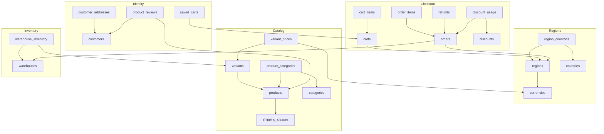

<!--
  AUTO-GENERATED by apps/mcp/knowledge/generate.ts
  Do not edit manually. Run the script to regenerate.
  To add or modify topics, edit files in apps/mcp/knowledge/topics/
  description:  Reference documentation for the SQLite database schema managed by the Fufuni Merchant Durable Object, including migrations and table structures.
  model:        gemini-3-flash-preview
  tokens_in:    14864
  tokens_out:   2636
  api_endpoint: https://generativelanguage.googleapis.com/v1beta
  manual_facts_checksum: ed7594375e2e0daba369483710e3ff87e51aa2629d0a41b246bbe0bb6ad07f94
  sources_checksum: 56e619248dd1546776ba5d7f77399678d0d129a51d5bbaf54e10eb79e53acce4
  source_file_hashes:
    apps/merchant/src/do.ts: 56e619248dd1546776ba5d7f77399678d0d129a51d5bbaf54e10eb79e53acce4
-->

## Durable Object Persistence Architecture

Fufuni leverages the Cloudflare Durable Objects (DO) SQLite storage backend. Unlike traditional KV-based persistence, the Merchant DO manages a relational database directly within the `ctx.storage.sql` instance. This architecture ensures transactional integrity for critical e-commerce operations like inventory reservation and order processing.

### The Initialization and Migration Pattern

Persistence is managed via a two-stage process within the `MerchantDO` class. The `ensureInitialized()` method is the gatekeeper for all database operations. 

1.  **Baseline Schema**: A constant `SCHEMA` containing the base DDL (Data Definition Language) is executed using `this.sql.exec()`. This uses `CREATE TABLE IF NOT EXISTS` to ensure the structure exists without overwriting data.
2.  **Runtime Migrations**: Instead of an external migration runner, Fufuni tracks changes in a dedicated `migrations` table. An array of migration objects is iterated; each object contains a unique name and the SQL delta. If the name is missing from the `migrations` table, the SQL is applied, and the name is recorded.

This pattern allows the framework to evolve the schema (e.g., adding the `refunds` enrichment in Migration 034) across distributed DO instances without manual intervention or storage version flags.

```typescript
// Example of how the Fufuni backend interacts with the Durable Object DB
// via the getDb helper (Hono context)
import { Context } from 'hono';
import { getDb } from '@/lib/db';

export async function getProductWithVariants(c: Context, handle: string) {
  const db = getDb(c.var.db);
  
  // Fufuni uses raw SQL with typed results. No ORM is used.
  const sql = `
    SELECT p.*, v.id as variant_id, v.sku, v.price_cents
    FROM products p
    LEFT JOIN variants v ON p.id = v.product_id
    WHERE p.handle = ? AND p.status = 'active'
  `;
  
  const results = await db.query<any>(sql, [handle]);
  return results;
}
```

## Core Infrastructure Tables

These tables define the foundational settings of the store, including multi-currency support, regional logic, and API security.

### migrations
Tracks applied schema updates to ensure runtime consistency.

| Column | Type | Notes |
| :--- | :--- | :--- |
| name | TEXT | Primary Key. The unique identifier of the migration. |
| applied_at | TEXT | ISO8601 timestamp of when the migration ran. |

### api_keys
Manages authentication for the Public and Admin APIs.

| Column | Type | Notes |
| :--- | :--- | :--- |
| id | TEXT | Primary Key (UUID). |
| key_hash | TEXT | SHA-256 hash of the key. Unique index applied. |
| key_prefix | TEXT | Plaintext prefix (e.g., `sk_` or `pk_`). |
| role | TEXT | Constraint: `public` or `admin`. |

### currencies
Defines the monetary units supported by the merchant.

| Column | Type | Notes |
| :--- | :--- | :--- |
| id | TEXT | Primary Key. |
| code | TEXT | ISO code (e.g., 'USD', 'EUR'). Unique index. |
| symbol | TEXT | Display symbol (default: '$'). |
| decimal_places | INTEGER | Usually 2. |

### regions
Aggregates countries, warehouses, and tax settings into a single purchasing context.

| Column | Type | Notes |
| :--- | :--- | :--- |
| id | TEXT | Primary Key. |
| currency_id | TEXT | Foreign Key to `currencies`. |
| tax_inclusive | INTEGER | Boolean flag (0 or 1). |
| is_default | INTEGER | Boolean flag. Only one should be default. |

```typescript
// Example: Querying a region with its currency
const region = await db.query(`
  SELECT r.display_name, c.code, c.symbol 
  FROM regions r
  JOIN currencies c ON r.currency_id = c.id
  WHERE r.status = 'active'
`);
```

## Product and Inventory Catalog

Fufuni uses a hierarchical product model where a `Product` serves as a container for multiple `Variants`. Inventory is tracked at the SKU (Variant) level.

### products
The high-level entity representing a sellable item.

| Column | Type | Notes |
| :--- | :--- | :--- |
| id | TEXT | Primary Key. |
| handle | TEXT | URL-friendly slug. Unique index. |
| status | TEXT | `active` or `draft`. |
| shipping_class_id| TEXT | Optional link to `shipping_classes`. |

### variants
The specific SKU-level item that can be purchased.

| Column | Type | Notes |
| :--- | :--- | :--- |
| id | TEXT | Primary Key. |
| product_id | TEXT | Foreign Key to `products`. |
| sku | TEXT | Unique identifier for inventory. |
| price_cents | INTEGER | Base price in the default currency. |
| weight_g | INTEGER | Weight in grams for shipping calc. |

### warehouse_inventory
Tracks physical stock across different fulfillment locations.

| Column | Type | Notes |
| :--- | :--- | :--- |
| id | TEXT | Primary Key. |
| sku | TEXT | Unique within a warehouse. |
| warehouse_id | TEXT | Foreign Key to `warehouses`. |
| on_hand | INTEGER | Physical stock available. |
| reserved | INTEGER | Stock tied to open carts or pending orders. |

```typescript
// Example: Checking total availability for a SKU across all warehouses
async function getStock(db: any, sku: string) {
  const [stock] = await db.query(`
    SELECT SUM(on_hand - reserved) as available
    FROM warehouse_inventory
    WHERE sku = ?
  `, [sku]);
  return stock?.available ?? 0;
}
```

## Sales and Fulfillment

This section covers the lifecycle of a purchase from cart creation to checkout and potential refunds.

### carts
A temporary state container for a shopping session. Carts expire automatically via a cleanup worker.

| Column | Type | Notes |
| :--- | :--- | :--- |
| id | TEXT | Primary Key. |
| status | TEXT | `open`, `checked_out`, or `expired`. |
| shipping_country | TEXT | ISO code used for tax/shipping calculation. |
| taxes_json | TEXT | Stores calculated tax lines as JSON. |

### orders
The finalized record of a transaction.

| Column | Type | Notes |
| :--- | :--- | :--- |
| id | TEXT | Primary Key. |
| number | TEXT | Human-readable order number (Unique). |
| status | TEXT | `paid`, `shipped`, `refunded`, etc. |
| viewtoken | TEXT | Unique token for public order tracking access. |

### refunds
Records partial or full reversals of transactions. Updated in Migration 034 to support advanced auditing.

| Column | Type | Notes |
| :--- | :--- | :--- |
| id | TEXT | Primary Key. |
| order_id | TEXT | Foreign Key to `orders`. |
| amount_cents | INTEGER | The amount returned. |
| reason | TEXT | `duplicate`, `fraudulent`, or `requested_by_customer`. |
| currency | TEXT | The currency of the refund (Default: 'EUR'). |

```typescript
// Example: Inserting a partial refund for an order
async function createRefund(db: any, orderId: string, amount: number, reason: string) {
  return await db.run(`
    INSERT INTO refunds (id, order_id, amount_cents, reason, status, updated_at)
    VALUES (?, ?, ?, ?, 'completed', datetime('now'))
  `, [crypto.randomUUID(), orderId, amount, reason]);
}
```

## Customer and Social Features

### customers
Core identity table. Note that Auth0 identifiers are stored in `auth_provider_id`.

| Column | Type | Notes |
| :--- | :--- | :--- |
| id | TEXT | Primary Key. |
| email | TEXT | Unique index. |
| auth_provider_id | TEXT | The 'sub' claim from Auth0 JWT. Indexed for speed. |
| total_spent_cents| INTEGER | Denormalized sum for marketing segments. |

### product_reviews
Moderated social feedback for products.

| Column | Type | Notes |
| :--- | :--- | :--- |
| id | TEXT | Primary Key. |
| product_id | TEXT | Foreign Key to `products`. |
| rating | INTEGER | 1 to 5. |
| status | TEXT | `pending`, `approved`, or `rejected`. |

## Store Configuration and Theming

### store_themes
Contains merchant-defined default visual configurations.

| Column | Type | Notes |
| :--- | :--- | :--- |
| id | TEXT | Primary Key (e.g., `theme_classic`). |
| is_active | INTEGER | Boolean flag. |
| config_json | TEXT | JSON string containing `radius`, `accentOklch`, etc. |

**Important Fact**: While `store_themes` holds the merchant's global defaults, per-user theme preferences (Dark/Light mode) are stored in Auth0 `user_metadata` and passed via JWT claims, not in this SQLite table.

## Entity Relationship Overview

The following relationship map illustrates the primary foreign key constraints within the Fufuni Merchant DO:



### Table Join Constraints

- **One-to-Many**: One `Product` can have many `Variants`. One `Order` can have many `Refunds`.
- **Many-to-Many**: `Regions` and `Countries` are linked via `region_countries`. `Products` and `Categories` are linked via `product_categories`.
- **Polymorphic Attributes**: Taxes are handled via the `tax_rates` table, which can match by `country_code` or a specific `tax_code` provided at the variant level.
- **Deletions**: Most join tables (like `cart_items` or `order_items`) use `ON DELETE CASCADE` to maintain referential integrity when a parent record is removed.