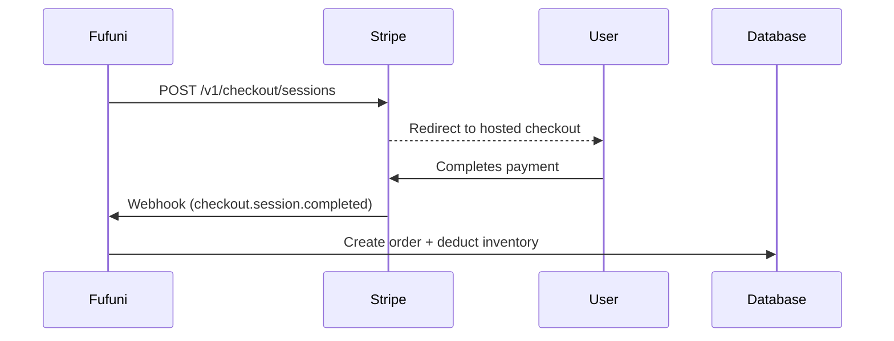

<!--
  AUTO-GENERATED by apps/mcp/src/lib/generate-knowledge-modules/generate.ts
  Do not edit manually. Run the script to regenerate.
  To add or modify topics, edit files in apps/mcp/src/knowledge/topics/
  description:  Call this when implementing checkout flows, UCP integration, or Stripe payment handling in Fufuni.
  model:        mistral/mistral-medium
  tokens_in:    42145
  tokens_out:   2126
  api_endpoint: https://gateway.ai.cloudflare.com/v1/a924ebae983be4a487a0c9d5f9bd8706/default/compat
  manual_facts_checksum: b1276c1cdfe5e0bf6be135d5ceba2c17778580979a164223329f8dadc414b28f
  sources_checksum: 8097941bca7cd53a32f95b7ec0a35cb703fe2b9f3a1888450480a60ea10b2521
  source_file_hashes:
    apps/merchant/src/routes/checkout.ts: abace0ab1fedaa81085bf05327cf7e7dd48d86593b3513a98c94dda526afd7d1
    apps/merchant/src/routes/ucp.ts: 51278fb68071352cf43d6fdef1aa62146cceb7ea8e5be059413dd4050fecbd06
    apps/merchant/src/schemas.ts: 775d20cedc51c4c088ff8e421630840955a17769af4796df1319fc554456b0cd
-->

## Checkout & UCP Reference

### 1. UCP (Universal Commerce Protocol) Endpoints

#### **POST `/ucp/v1/checkout-sessions`**
Creates a UCP-compliant checkout session for AI agents or third-party integrations.

**Request Body** (`CreateCheckoutBodySchema`):
```typescript
{
  line_items: [
    {
      item: { id: string }, // Variant ID or SKU
      quantity: number
    }
  ],
  buyer?: {
    email?: string,
    first_name?: string,
    last_name?: string
  },
  currency: string, // ISO 4217 code
  payment?: {
    handler_id?: string // e.g., 'stripe_checkout'
  }
}
```

**Response Shape** (`UCPCheckoutSessionSchema`):
```typescript
{
  ucp: { version: string, capabilities: Array<{name: string, version: string}> },
  id: string,
  status: 'incomplete' | 'ready_for_complete' | 'requires_escalation',
  currency: string,
  line_items: Array<{
    id: string,
    item: { id: string, title?: string, description?: string },
    quantity: number,
    unit_price: { amount: number, currency: string },
    total_price: { amount: number, currency: string }
  }>,
  totals: Array<{
    type: 'subtotal' | 'tax' | 'shipping' | 'grand_total',
    amount: number,
    currency: string
  }>,
  payment: { handlers: Array<UCPPaymentHandler> }
}
```

**When to Call**:
- When an AI agent needs to validate a cart before checkout
- For headless integrations where you need price resolution without Stripe
- To compute taxes and shipping before showing the order summary

**Example**:
```typescript
const response = await fetch('https://merchant.fufuni.shop/ucp/v1/checkout-sessions', {
  method: 'POST',
  body: JSON.stringify({
    line_items: [{ item: { id: 'TEE-BLK-M' }, quantity: 2 }],
    currency: 'USD'
  })
});
```

---

### 2. Checkout Endpoint

#### **POST `/v1/carts/{cartId}/checkout`**
Initiates Stripe payment for an existing cart.

**Authentication**: Requires `authMiddleware` (Auth0 JWT in `Authorization` header)

**Request Body** (`CheckoutBody`):
```typescript
{
  success_url: string, // URL after successful payment
  cancel_url: string,  // URL if user cancels
  collect_shipping?: boolean = false,
  shipping_countries?: string[] = ['US'],
  shipping_options?: Array<Stripe.Checkout.SessionCreateParams.ShippingOption>
}
```

**Full Response** (`CheckoutResponse`):
```typescript
{
  checkout_url: string, // Stripe redirect URL
  stripe_checkout_session_id: string
}
```

**What Happens on Success**:
1. Cart status changes from `open` → `checked_out`
2. Inventory is reserved (atomic SQL transaction)
3. Stripe Checkout Session is created with:
   - Line items (HT/HTT adjusted for tax inclusivity)
   - Tax lines (as separate Stripe items)
   - Shipping options (if `collect_shipping=true`)
4. Discounts are validated and applied via Stripe coupons

**Example**:
```typescript
const result = await fetch(`https://merchant.fufuni.shop/v1/carts/${cartId}/checkout`, {
  method: 'POST',
  headers: { 'Authorization': `Bearer ${jwtToken}` },
  body: JSON.stringify({
    success_url: 'https://example.com/success',
    cancel_url: 'https://example.com/cancel'
  })
});
```

---

### 3. Inventory Validation

**When It Fires**:
- During `POST /v1/carts/{cartId}/checkout`
- During `POST /v1/carts/{cartId}/items` (when adding items)
- Synchronously inside the Durable Object transaction

**Error Behavior**:
```typescript
// Throws 409 Conflict if inventory is insufficient
if (available < qty) {
  throw ApiError.insufficientInventory(sku);
}
```

**SQL Implementation**:
```sql
-- getAvailableQty() helper
SELECT COALESCE(SUM(on_hand - reserved), 0) as available
FROM inventory
WHERE sku = ?
```

**Example Error Response**:
```json
{
  "code": "insufficient_inventory",
  "message": "Only 3 of TEE-BLK-M available (requested 5)"
}
```

---

### 4. Tax Computation

**How It Works**:
1. **Region Detection**: Uses `cart.region_id` to determine tax rules
2. **Tax Engine Call**:
   ```typescript
   const { taxes, itemRates } = await calculateCartTaxes(db, cartId, cart.shipping_country);
   ```
3. **HT/HTT Handling**:
   - If `region.tax_inclusive = true`, prices are treated as TTC
   - Tax lines are added as separate Stripe items
4. **Stripe Integration**:
   ```typescript
   // Adjust unit_amount for tax-inclusive regions
   if (taxInclusive) {
     unitAmount = Math.round(item.unit_price_cents / (1 + (itemRates.get(item.sku) || 0) / 100));
   }
   ```

**Example Tax Calculation**:
```typescript
// calculateCartTaxes() returns:
{
  taxes: [
    { name: 'VAT', amount_cents: 400, tax_inclusive: true }
  ],
  itemRates: new Map([['TEE-BLK-M', 20]]) // 20% VAT
}
```

---

### 5. Stripe Integration Flows

#### **Checkout Session Flow** (Default)


#### **PaymentIntent Flow** (Legacy)
```typescript
// Only used for custom payment UIs
const paymentIntent = await stripe.paymentIntents.create({
  amount: totalCents,
  currency: cart.currency.toLowerCase(),
  metadata: { cart_id: cartId }
});
```

**Key Differences**:
| Feature               | Checkout Session       | PaymentIntent          |
|-----------------------|------------------------|------------------------|
| Hosted UI             | ✅ Stripe-hosted       | ❌ Custom UI required  |
| 3DS Support           | ✅ Automatic           | ❌ Manual handling     |
| Tax Lines             | ✅ Separate items      | ❌ Manual calculation |
| Shipping Collection   | ✅ Built-in            | ❌ Custom forms        |

---

### 6. Stripe Webhook Events

**Handled Events**:
1. **`checkout.session.completed`**:
   - Updates order status to `paid`
   - Deducts inventory
   - Creates customer record (if new)

2. **`payment_intent.succeeded`**:
   - Same as above for PaymentIntent flow

3. **`payment_intent.payment_failed`**:
   - Marks order as `failed`
   - Releases reserved inventory

**Implementation**:
```typescript
// In webhooks.ts
app.post('/stripe', async (c) => {
  const event = stripe.webhooks.constructEvent(
    await c.req.text(),
    c.req.header('Stripe-Signature'),
    c.env.STRIPE_WEBHOOK_SECRET
  );

  switch (event.type) {
    case 'checkout.session.completed':
      await handleCheckoutSession(c.env.DB, event.data.object);
      break;
    // ... other cases
  }
});
```

---

### 7. Required Wrangler Secrets

**Mandatory**:
```bash
# .dev.vars or wrangler secret put
STRIPE_SECRET_KEY=sk_live_...
STRIPE_WEBHOOK_SECRET=whsec_...
```

**Development Overrides**:
```bash
# wrangler.toml
[vars]
STRIPE_SECRET_KEY = "@stripe_test_key"
```

**Verification**:
```typescript
// In routes/checkout.ts
const stripeSecretKey = c.get('auth').stripeSecretKey;
if (!stripeSecretKey) {
  throw ApiError.invalidRequest('Stripe not connected');
}
```

---

### Key Implementation Notes

1. **Idempotency**: All checkout operations use `cartId` as the idempotency key
2. **Atomic Operations**: Inventory reservation and order creation happen in a single DO transaction
3. **Tax Compliance**: Always use `calculateCartTaxes()` - never compute taxes manually
4. **Stripe Versioning**: Uses Stripe API version `2023-10-16` (configured in `stripe.ts`)

**Critical Error Cases**:
- `409 Conflict`: Inventory insufficient or cart already checked out
- `402 Payment Required`: Stripe credentials missing
- `422 Unprocessable Entity`: Tax calculation failed

For testing, use Stripe test cards:
- Success: `4242 4242 4242 4242`
- 3DS: `4000 0025 0000 3155`
- Failure: `4000 0000 0000 0002`