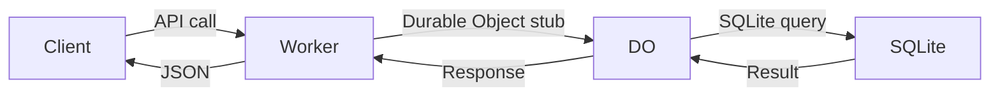

<!--
  AUTO-GENERATED by apps/mcp/src/lib/generate-knowledge-modules/generate.ts
  Do not edit manually. Run the script to regenerate.
  To add or modify topics, edit files in apps/mcp/src/knowledge/topics/
  description:  Use this when explaining the overall architecture, technology stack, and conventions of the Fufuni e-commerce framework.
  model:        mistral/magistral-medium-latest
  tokens_in:    28912
  tokens_out:   1449
  api_endpoint: https://gateway.ai.cloudflare.com/v1/___cloudflare_account_id___/default/compat
  manual_facts_checksum: 041690e96af3089f72ba0af15a25dc9cc96a498d0294f24e7fcea9cc98806567
  sources_checksum: 6195b23bc58ad43063baffdf635f36a1e3514c5552eceb8100bb47f7d436c4f6
  source_file_hashes:
    README.md: 5990ecab00f4a3c3cbccca147e754cd3bfeb4938f792235d7111fd76719b00c2
    apps/merchant/src/index.ts: c13e32dc35e56f04e30104d8a4c091cf4146a3691d9e2d8a6be6511279b4ed7a
-->
<!--mcp-tags: ["general","frontend","backend","database","auth","commerce"]-->

## Framework Overview

Fufuni is an open-source, AI-native e-commerce framework designed to run entirely within the free tiers of Cloudflare Workers, Auth0, Stripe, and other services. It provides a complete solution for building online stores with features like multi-currency support, multi-region pricing, AI-assisted translation, and more, all while keeping costs at $0/month.

## Stack

| Layer | Technology | Notes |
|-------|------------|-------|
| Frontend | React 19, Vite, HeroUI v3 | SPA for both storefront and admin |
| Backend | Cloudflare Workers, Hono, Zod-OpenAPI | Edge API with OpenAPI documentation |
| Database | Durable Objects with SQLite | SQLite runs inside a single JS isolate |
| Storage | Cloudflare R2 | For product images and assets |
| Auth | Auth0 | Passwordless and social login |
| Payments | Stripe | Checkout integration |
| Email | Mailgun | Order notifications |
| Deployment | GitHub Pages (frontend), Cloudflare Workers (backend) | Free hosting |

## Monorepo Structure

The Fufuni monorepo uses Turborepo for task orchestration and consists of three main workspaces:

- **apps/client**: React frontend (storefront + admin)
  - `src/pages`: Storefront and admin pages
  - `src/components`: Reusable UI components
  - `src/lib`: API client and utilities
  - `src/config`: Site configuration and navigation

- **apps/merchant**: Cloudflare Worker (Hono + Zod-OpenAPI)
  - `src/routes`: API routes for catalog, checkout, orders, etc.
  - `src/do.ts`: Durable Object with SQLite schema
  - `src/migrations`: SQL migration files
  - `src/middleware`: Rate limiting, KV cache, etc.

- **apps/mcp**: MCP server for AI integration
  - `src/knowledge`: Generated MCP knowledge base
  - `src/scripts`: Scripts for generating MCP responses

## Request Lifecycle

A typical request flows through the following stages:

1. **Client Request**: Initiated from the React SPA (e.g., `GET /v1/products`).
2. **Cloudflare Worker**: The request hits the Hono app in the Cloudflare Worker.
3. **Middleware**: Passes through middleware like CORS, rate limiting, and KV cache.
4. **Durable Object**: The Worker fetches the Durable Object stub and forwards the request.
5. **SQLite Execution**: The Durable Object executes SQL queries against its embedded SQLite database.
6. **Response**: The result is sent back through the chain to the client.



## Key Conventions

- **API Keys**: Public keys prefixed with `pk_`, admin/secret keys prefixed with `sk_`. Never expose `sk_` keys to the frontend.
- **Authentication**: Auth0 for identity management with RBAC via JWT permissions (e.g., `admin:store`).
- **Database Schema**: Changes must be applied in three places: `SCHEMA` constant in `do.ts`, `ensureInitialized()` in `do.ts`, and a new SQL file in `apps/merchant/migrations/`.
- **Error Handling**: Custom `ApiError` class for consistent error responses.
- **Internationalization**: `react-i18next` for frontend, with multilingual product fields stored as JSON locale maps.
- **Navigation**: Site configuration in `apps/client/src/config/site.ts` with permission-based visibility for navbar items.

```typescript
// Example of a new navigation item in site.ts
{
  title: 'New Page',
  href: '/new-page',
  permissions: ['admin:store'], // Only visible to users with this permission
}
```